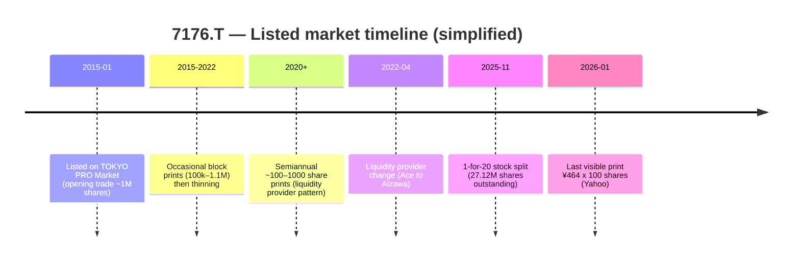

# 7176.T — Skeptical Equity Report

**Simplex Financial Holdings Co., Ltd.**  
**Date:** 4 June 2026  
**Author:** Marvin (adversarial / investor-skeptic pass)  
**Audience:** Bryan Lawrence / Oakcliff — personal sizing **USD 10k–100k**  
**Stance:** **Do not treat as a normal public equity until liquidity and access are verified**

Related files: `deep_dive_2026-06-04.md`, `valuation.json`, `adversarial_2026-06-04.md`, 136 IR PDFs under `7176.T/`.

---

## Executive summary (skeptic)

Simplex is a **profitable, fast-growing Japan asset manager and ETF sponsor** with FY2026 parent earnings of **¥317** per share (split-adjusted) and **¥1.34 trillion** of assets under management. On paper, a **~3.4×** multiple to **mid-cycle** owner cash (**¥137** per share, FY2025) and a mechanical **50%+** seven-year annual return look like a hidden gem.

**We do not think a USD 10k–100k position is a realistic or well-understood public-market bet today.** Reasons:

1. **Wrong market label:** The stock is on **TOKYO PRO Market**, not TSE Prime. Access is restricted to **specified / professional investors**; general retail cannot buy on the open market ([JPX TPM overview](https://www.jpx.co.jp/english/equities/products/tpm/outline/01.html)).
2. **Almost no trading:** Since listing in **January 2015**, Yahoo Finance shows only **15 calendar days** with non-zero volume in **~11 years** (last print **7 Jan 2026**, **100 shares** at **¥464**).
3. **“Cheap” price is not a market price:** The last print is a **liquidity-provider / token trade**, not evidence that you can build or exit **$10k–100k** at that level.
4. **Earnings quality:** FY2026 revenue growth was driven by **performance (success) fees +53.6%**, while **AUM +2.9%**. Normalizing on FY2025 owner cash is correct; assuming FY2026 repeats is not.
5. **No cash return to minorities:** **Zero dividend** FY2025–FY2026; large cash balance (**¥23.6 bn** at FY2026) stays inside the group.
6. **Governance / key person:** Representative CEO **Hiromasa Mizushima** is described in issuer filings as a **major shareholder** and central to fund operations ([issuer information, June 2025](7176.T/01_Official/Issuer_Information/20250630_発行者情報__irnews20250630-1.pdf)).

**Bottom line:** The business may be good; the **listed minority equity line is not a conventional, investable security** for your use case. High spreadsheet IRR is **arithmetic on a stale quote**, not an executable edge.

---

## What the company actually is

| Item | Fact (filings) |
|------|----------------|
| Legal name | Simplex Financial Holdings Co., Ltd. |
| Ticker | **7176** (TSE code; segment **TOKYO PRO Market**) |
| Founded (holdco) | October 2006; asset management roots from 1999 |
| HQ | Tokyo (Marunouchi) |
| Business | Investment management, ETF listing/management, “open innovation” between investors and banks |
| Reportable segment | **Single segment:** investment management and advisory |
| Employees | **55** (FY2026) |
| Shares outstanding | **27.12 million** (post **1-for-20** split effective **1 Nov 2025**) |
| J-Adviser | Japan M&A Center, Inc. |

**Sources:** FY2026 earnings release (`finfo2026.pdf`), variance notice (`Pnotice2026-1.pdf`), issuer information PDFs in `7176.T/01_Official/`.

---

## Why the “fantastic investment” story sounds plausible

| Bull hook | Why it seduces |
|-----------|----------------|
| High ROE (~59% FY2026) | Looks like a compounder |
| ETF + hedge-fund heritage | Niche “croupier” on Japan flows |
| Low P/E on mid-cycle EPS | ~3.4× on ¥137 FY2025 earnings at ¥464 print |
| Mechanical IRR >50% | Lawrence model at last print |
| Cash building | OCF ¥11.7 bn FY2026 |

**Skeptic translation:** You are being offered **equity in a private-quality balance sheet** wrapped in a **PRO-market shell** with **no real float and no dividend**.

---

## Twelve reasons to push back (disprove “fantastic” for your wallet)

### 1. You may not be allowed to buy it

TOKYO PRO Market limits **buyers** to specified investors (qualified institutions, certain corporates, individuals who elect “specified investor” status with a broker, non-residents, etc.). **General Japanese retail cannot place buy orders** on the market ([JPX](https://www.jpx.co.jp/english/equities/products/tpm/outline/01.html)). A U.S.-based investor must confirm eligibility with a **Japan broker** (professional / specified investor pathway). **CapIQ will not solve access.**

### 2. There is effectively no public trading

**Yahoo Finance (`7176.T`), full history, auto-adjusted for splits:**

| Date | Close (JPY, split-adj.) | Volume (shares) |
|------|-------------------------|-----------------|
| 2015-01-27 | 0.44 | 1,000,000 |
| 2016-01-20 | 2.42 | 100,000 |
| 2018-03-13 | 21.12 | 1,100,000 |
| 2020-02-10 | 223.10 | 1,000 |
| 2021-01-07 | 323.50 | 1,000 |
| 2021-07-06 | 463.50 | 1,000 |
| 2022-01-07 | 634.00 | 1,000 |
| 2022-07-06 | 884.00 | 1,000 |
| 2023-01-11 | 1,334.00 | 1,000 |
| 2023-07-04 | 1,703.00 | 100 |
| 2024-01-10 | 2,330.00 | 100 |
| 2024-07-03 | 3,885.00 | 100 |
| 2025-01-08 | 5,130.00 | 100 |
| 2025-07-03 | 7,110.00 | 100 |
| 2026-01-07 | **464.00** | **100** |

- **15 trading days with volume** in ~2,795 calendar days (~0.5%).
- **Average volume (Yahoo): 0.**
- Pattern since 2023: **100 shares** roughly **twice per year** — consistent with **liquidity provider** obligations, not price discovery.

### 3. The January 2026 print is not “the market clearing at ¥464”

- **¥464 × 100 shares = ¥46,400** (~USD 300) of stock changed hands.
- **Implied market cap** at ¥464 × 27.12M shares ≈ **¥12.6 bn** (~USD 85M at ¥150/USD) — but **almost none of the register trades**.
- **Do not** annualize IRR from this quote for a **$10k–100k** ticket.

### 4. November 2025 split confuses “crash” narratives

On **1 Nov 2025** the company executed a **1-for-20** stock split (record date 31 Oct 2025) to lower the **investment unit** ([IR notice](7176.T/03_Events/Timely_Disclosures/20250924_株式分割及び定款の一部変更に関するお知らせ__irnews20250924.pdf)). Split-adjusted, **¥7,110 (Jul 2025)** → **¥355** theoretical, vs **¥464** last print — **not** a 93% fundamental collapse. Vendors showing **52-week highs near ¥7,110** are mixing pre-split optics.

### 5. Performance fees are cyclical, not normalized earnings

| Fee type | FY2026 | YoY |
|----------|--------|-----|
| AUM | ¥1,335.7 bn | +2.9% |
| Base fees | ¥78.69 bn | +17.1% |
| **Success fees** | **¥143.16 bn** | **+53.6%** |

Success fees were roughly **65%** of base+success fees in FY2026. If markets mean-revert, **FY2026 ¥317 EPS is a peak**, not mid-cycle. Using **FY2025 ¥137** for valuation is intellectually honest; using FY2026 while citing low P/E is **double-counting cheapness**.

### 6. AUM growth did not drive the earnings explosion

Revenue **+38.5%** with AUM **+2.9%** means **fee mix and performance**, not secular AUM tailwind. **Partial moat at best** — clients can leave; global ETF sponsors compete.

### 7. No dividend — minority is last in line for cash

Filings: **no cash dividend** FY2025–FY2026. Cash rose to **¥23.6 bn** (FY2026). For a **non-control** holder, value realization requires **future dividend policy change**, **buyback at fair price**, or **sale of control** — none assured.

### 8. Buybacks happen off-exchange (ToSTNeT-3), not in the tape

The IR archive shows **repeated** “off-auction” **ToSTNeT-3** treasury purchases and cancellations (2017–2025). These support liquidity and capital structure but **do not create a daily exit** for you. **Aug 2025** cluster of notices = corporate action, not proof of float.

### 9. Liquidity provider churn

**Ace Securities** retired as liquidity provider **30 Apr 2022**; **Aizawa Securities** appointed ([IR 8 Apr 2022](7176.T/03_Events/Timely_Disclosures/20220408_流動性プロバイダーの異動に関するお知らせ__irnews20220408.pdf)). PRO-market names depend on designated market makers — another layer between you and natural buyers.

### 10. Key person and small team risk

~**55** employees running **¥1.3 tn** AUM and a broad ETF lineup is efficient but fragile. Issuer filing flags CEO **Mizushima** as **major shareholder** and operational linchpin.

### 11. No third-party research edge in repo

`third-party-analyses/` has **no approved** sell-side or Substack cross-check. You are alone with filings and mechanical models.

### 12. Yuho (annual securities report) still missing locally

EDINET filer **E31267** — full **yuho** not ingested. Segment detail, related-party flows, and officer shareholdings need that document.

---

## TSE trading history — what actually happened

**Why dashboards show “no trading data”:**

| Layer | Behavior |
|-------|----------|
| **Exchange tape** | PRO market + minimal prints → most days **zero volume** |
| **Yahoo / Stooq** | Month-end return **0%** when price unchanged (no trade) |
| **Portfolio backtests** | `7176_T.csv` vault: **~0%** for almost all months |
| **README error** | Says “TSE Prime” — **incorrect**; JPX lists **TOKYO PRO Market** |

**Listing date (issuer history):** **January 2015** on TOKYO PRO Market ([issuer information](7176.T/research/evidence/_text_en/20250630_発行者情報__irnews20250630-1.pdf)).

---

## Valuation — why high IRR is a mirage for you

| Input | Value | Skeptic note |
|-------|-------|--------------|
| Price today | **¥464** | Last **100-share** print, **7 Jan 2026** |
| Mid-cycle owner cash | **¥137.14** / sh (FY2025) | Correct croupier anchor |
| Peak owner cash | **¥317.33** / sh (FY2026) | Do not use as “normal” |
| Mechanical base IRR | **~50%** / yr (7-yr model) | **Not achievable** without (a) real liquidity, (b) earnings persistence, (c) re-rating |
| Book / sh (FY2026) | **¥757** | Asset-light manager; book is not a **downside floor** for fee income |
| Stance | **Watch / avoid sizing** | Illiquidity overrides math |

**Reverse question:** If the stock were truly mispriced with **50%** annual returns, why would insiders and the liquidity provider allow **100 shares every six months** while **buying back via ToSTNeT** instead of attracting real buyers?

---

## Can you deploy USD 10k–100k?

| Size (USD) | Rough JPY (@150) | Shares @ ¥464 | Realistic on open tape? |
|------------|------------------|---------------|-------------------------|
| 10,000 | ¥1.5M | ~3,200 | **No** — would require **32×** the largest recent **annual** visible volume |
| 50,000 | ¥7.5M | ~16,200 | **No** |
| 100,000 | ¥15M | ~32,300 | **No** |

**Paths that might work (all non-standard):**

1. **Negotiated block** with controlling holders / company (not disclosed in public IR).
2. **ToSTNeT-3** off-auction purchase arranged by a Japan broker (if eligible).
3. **Primary / private** issuance (not offered in reviewed filings).
4. **Becoming a “specified investor”** under Japanese rules, then working with **Aizawa** (liquidity provider) for custom liquidity.

**Until one of these is confirmed in writing from a broker, treat sizing as zero.**

---

## Will CapIQ help?

**Yes, for diligence — no, for execution.**

| CapIQ (or similar) | Value |
|--------------------|--------|
| Historical **TSE/PRO** prints and **turnover** | Faster than Yahoo; may show **off-book** counts |
| **Ownership / float** | Who controls the 27M shares? Insider %? |
| **Peer multiples** | Japan asset managers (e.g. listed AM firms on **Prime**) |
| **Segment estimates** | If analyst coverage exists (often **none** on PRO) |
| **M&A / control premia** | Relevant if only exit is sale of company |

**CapIQ cannot:** qualify you as a TPM buyer, place orders, or fix **100-share** liquidity.

**If you log in:** export **7176.T** price/volume history, **shareholders** table, and any **reported float** — paste into `7176.T/research/` for a second-pass cross-check.

---

## What could make us less skeptical

| Falsifier | Threshold |
|-----------|-------------|
| Sustained **daily** volume | e.g. **>¥50M**/day for 60 sessions |
| **Live quote** at size | Broker depth for **≥USD 25k** without huge impact |
| **Dividend** or explicit payout policy | Filing commitment |
| **Two years** of success fees **without** normalization | Then FY2026 anchor gains weight |
| **Yuho** ingested | Related-party and cap table clean |
| **Market upgrade** | Migration to **TSE Prime** (would be material; **not announced** in reviewed files) |

---

## Classification (unchanged mechanically, skeptic override)

| Field | Value |
|-------|-------|
| Archetype | croupier |
| Moat | partial |
| Dhando | partial |
| **Investor action** | **No public-market position** until access + liquidity proven |
| Mechanical IRR | 53.33% synthesis (see `valuation.json`) — **not an execution target** |

---

## Primary sources

- `7176.T/02_Quarterly/Earnings_Releases/20260528_2026年3_月期_決算短信_日本基準_連結__finfo2026.pdf`
- `7176.T/research/evidence/_text_en/20260528_前年同期実績_連結_との差異に関するお知らせ__Pnotice2026-1.pdf.en.txt`
- `7176.T/01_Official/Issuer_Information/` (発行者情報)
- [JPX TOKYO PRO Market — professional investors](https://www.jpx.co.jp/english/equities/products/tpm/outline/01.html)
- [JPX listed company search — 7176](https://www2.jpx.co.jp/tseHpFront/StockSearch.do?callJorEFlg=1&method=topsearch&topSearchStr=7176)
- Yahoo Finance: https://finance.yahoo.com/quote/7176.T/

---

## [HUMAN REVIEW]

- Confirm **investor eligibility** (U.S. person → Japan specified investor / professional).
- Pull **CapIQ** ownership and TPM trading history.
- Download **yuho** EDINET **E31267**.
- Fix `README.md` exchange line (**TOKYO PRO Market**, not TSE Prime).

## [PROPOSED MEMORY]

- [PROPOSED COMPANY] 7176.T: TOKYO PRO Market; ~15 volume days since 2015 listing; last print ¥464×100 (Jan 2026); high IRR is non-executable for USD 10k–100k; success-fee cyclicality; zero dividend.
