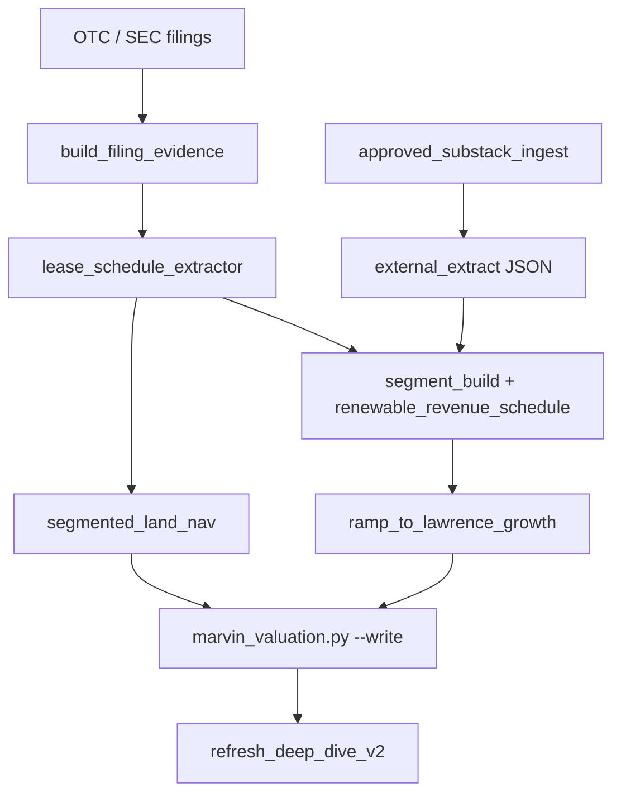

# Module improvement plan — land / royalty compounders (AZLCZ gap analysis)

**Date:** 2026-06-05  
**Trigger:** Groundbreaker RE AZLCZ deep dive exposed structural gaps vs. best-in-class external analysis  
**Peer tickers:** AZLCZ, TPL, KEWL, BWEL, LB, PCYO, MSB (royalty trusts)

---

## Executive summary

Marvin's AZLCZ onboard produced correct **filings-first facts** and optionality framing, but **under-modeled the contracted renewable royalty ramp** that Groundbreaker built project-by-project. Closing this gap requires new **pipeline modules**, not one-off narrative edits. Priority order: (1) lease schedule extractor, (2) approved-Substack ingest, (3) segmented land NAV, (4) ramp-to-growth translator, (5) peer template.

---

## Gap diagnosis (AZLCZ vs Groundbreaker)

| Capability | Marvin (pre-refresh) | Groundbreaker | Gap severity |
|------------|---------------------|---------------|--------------|
| Project-level lease map | Single "renewable" segment | AES West Camp, Invenergy Hashknife, 400 MW, Lark Point | **Critical** |
| Revenue ramp schedule | Flat 5% growth | $4M → $5.5M → $8M → $10M → $9.9M steady | **Critical** |
| Rent floor vs royalty upside | Not separated | $1.3M min ops + 2–4% gross royalty | High |
| Land segmentation | Single $/acre mark | 5 tiers by infrastructure access | High |
| Investor update ingest | OTC annuals only | Nov 2024 update ($1.3M rent) | High |
| External source OCR | None | Revenue table in image | Medium |
| NAV SOTP | Probability-weighted overlay | Asset-by-asset with comps | Medium |
| Interconnection / offtake graph | Not modeled | Cholla 500 kV, APS offtake | Medium |

---

## Proposed modules (build order)

### Module 1: `lease_schedule_extractor` (P0)

**Purpose:** Parse lessor notes (Note 10-style) + county approvals + investor updates into a structured `{project → phase → $/yr}` schedule.

**Inputs:**
- `{TICKER}/research/evidence/_text/*.txt`
- OTC investor updates / IR PDFs
- Optional: county planning PDFs (Vicki harvest)

**Outputs:**
- `{TICKER}/research/evidence/lease_schedule_{date}.json`
- Rows: `project_id`, `developer`, `mw`, `acres`, `phase` (development | construction | operations), `min_rent_usd`, `royalty_pct`, `offtaker`, `term_years`, `source_path`

**Trigger:** `valuation_mode: optionality` + renewable leases >20% revenue

**Peers:** AZLCZ, TPL (solar/wind notes), any OTC land lessor

---

### Module 2: `approved_substack_ingest` (P0)

**Purpose:** On `scan_third_party_sources.py` hit for approved Substacks, fetch post HTML, extract tables/images, write structured extract for cross-check.

**Inputs:** URL from `approved_substacks.md` topic map  
**Outputs:**
- `{TICKER}/investor-documents/research-notes/groundbreaker_{slug}_{date}.md` (text extract)
- `{TICKER}/research/evidence/external_extract_{source}_{date}.json` (numeric fields)

**Rules:**
- Auto-flag `[HUMAN REVIEW]` when extract cites investor updates not in filing evidence
- Never overwrite Lawrence Y0 from Substack alone; ramp feeds **growth** rows only unless human promotes

**Peers:** All `groundbreaker`, `ssi`, `lci` mapped tickers

---

### Module 3: `ramp_to_lawrence_growth` (P0)

**Purpose:** Translate `renewable_revenue_schedule.ramp[]` into `scenarios.base.growth_y1_5` with audit trail (replace flat % guesses).

**Logic:**
1. Read ramp midpoints ($M revenue)
2. Apply owner-cash conversion ratio (default 0.85 for land lessors; filing-calibrated)
3. Solve CAGR from Y0 owner cash to steady-state year N
4. Write `growth_explanation` + assumption ledger source string

**Script:** `_system/scripts/ramp_to_lawrence_growth.py --ticker AZLCZ`  
**Hook:** Call from `marvin_valuation.py --write` when `segment_build.renewable_revenue_schedule` present

---

### Module 4: `segmented_land_nav` (P1)

**Purpose:** Replace single `nav_floor` $/acre with infrastructure-tier segments (Groundbreaker Layer 2 pattern).

**Segments (configurable per ticker):**
- Under / adjacent to active leases
- Highway / rail frontage
- Development corridor
- Bulk interior grazing

**Outputs:** `nav_overlay.segments_or_options[]` with per-tier acre count, $/acre comp, overlap haircut

**Framework extension:** `_system/frameworks/segmented_land_nav.md` (proposal; needs `framework_governance.md`)

**Peers:** AZLCZ, KEWL, TPL, BWEL

---

### Module 5: `royalty_comp_multiple` (P1)

**Purpose:** Map lease portfolio quality → exit multiple (Groundbreaker 12–18x ladder).

**Inputs:** offtaker credit (investment-grade utility?), % operations-term vs development, royalty upside flag  
**Output:** `scenarios.base.exit_pfcf_y10` with rationale string

---

### Module 6: `infrastructure_adjacency_graph` (P2)

**Purpose:** Encode transmission, rail, water, fiber nodes as JSON for catalyst and segmentation triggers.

**AZLCZ nodes:** Cholla 500 kV, BNSF, Apache Railway, I-40, Vivacity fiber  
**Output:** `{TICKER}/research/evidence/infrastructure_graph_{date}.json`

**Use:** Mental models (HK market-structure), land tier assignment, Milly catalyst checks

---

### Module 7: `land_royalty_peer_template` (P1)

**Purpose:** Scaffold + checklist for onboarding TPL-style names.

**Path:** `_system/templates/ticker-scaffold/land_royalty/`  
**Includes:**
- Required evidence: 7+ years annuals, lease note, investor updates
- Mandatory segment_build shape (min rent + royalty + pipeline option)
- Cross-check: Groundbreaker if mapped in `approved_substacks.md`
- Milly gates: project-level growth rows must cite filing or approved external

---

## Pipeline integration

**Cloud refresh hook:** After `scan_third_party_sources.py`, if `groundbreaker` post found for ticker → run `approved_substack_ingest` → merge ramp into `valuation.json` if cross-check exists.

---

## QA gates (Milly additions)

| Gate | Fail condition |
|------|----------------|
| `lease_coverage` | Renewable >30% revenue but no project rows in segment_build |
| `growth_source` | `growth_y1_5` >15% without `renewable_revenue_schedule` or filing cite |
| `external_sync` | Groundbreaker extract newer than cross-check date |
| `ramp_falsifier` | FY annual rentals YoY down >10% while ramp assumes up |

---

## Immediate AZLCZ actions (done this session)

- [x] Adopt Groundbreaker royalty components in `segment_build`
- [x] Add `renewable_revenue_schedule` ramp JSON
- [x] Update growth to 30% / 4% / 16x exit (base)
- [x] `cross_check_groundbreaker_2026-06-05.md`
- [x] `third-party-analyses/references.md`
- [ ] **Next:** Download Aztec 11/4/24 investor update (Vicki) for rent-floor verification
- [ ] **Next:** Implement Module 3 script (ramp_to_lawrence_growth.py)

---

## Success metrics

| Metric | Before | Target after modules |
|--------|--------|----------------------|
| AZLCZ Lawrence base IRR | -21% | Filing-anchored ramp (now -8.7%) |
| Segment rows (renewable) | 1 | ≥4 named projects |
| External blend time | Manual | Auto on refresh when GB post maps |
| Peer onboard (land royalty) | Ad hoc | Template checklist pass |

---

## [PROPOSED MOI]

- [PROPOSED MOI] Land royalty compounders: project-level lease schedules are the MOI (mispriced optional income); flat % growth on consolidated owner cash systematically undervalues ramp timing for OTC lessors (AZLCZ, TPL pattern).
