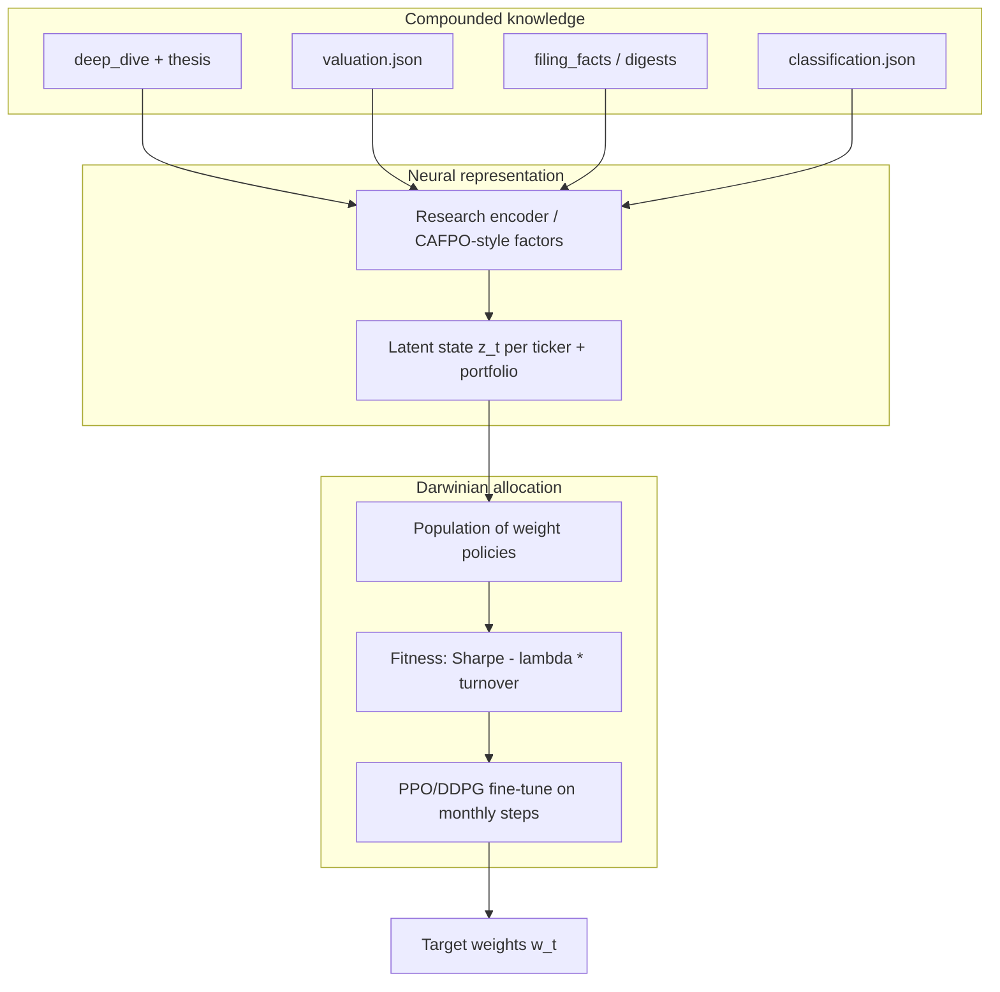

# Darwin tab — proposal for adaptive portfolio layer on Single Stock Dashboard

**Status:** Implemented (phases 0–4) — 2026-06-02

Run: `pip install -r _system/scripts/requirements-darwin.txt && python3 _system/scripts/build_darwin_portfolio.py`

Dashboard: **Holdings | Darwin** tab on [single-stock-investments](https://goldmandrew.github.io/single-stock-investments/).  
**Goal:** Replicate the *spirit* of [Darwin AI Ventures](https://darwinaiventures.com/) — adaptive, neural, reinforcement-learning-aware portfolio construction — using **our compounded ticker knowledge** (Marvin deep dives, filings, Lawrence IRR, falsifiers) rather than black-box high-frequency trading. Target **excess return with low turnover** (annual or quarterly rebalance, not daily churn).

**User source:** `Darwin AI Investments - 1Q26.pdf` (place copy at `_system/reference/quant-evolution/Darwin_AI_Investments_1Q26.pdf`). This proposal is informed by the public website, academic/industry RL-factor literature, SFI complexity economics, and the existing `single-stock-investments` stack — **not** by reproducing proprietary Darwin model weights.

---

## 1. Executive summary

| Layer | What we have today | What Darwin tab adds |
|-------|-------------------|----------------------|
| **Knowledge** | Per-ticker PDFs, `deep_dive_*.md`, `valuation.json`, `classification.json`, adversarial passes | Structured **feature store** + time series of conviction |
| **Judgment** | Human stance (core/hold/watch), Lawrence IRR, Popper falsifiers | **Neural encoder** of research state + **evolutionary policy** for weights |
| **Execution** | None (research dashboard) | **Suggested weights**, turnover budget, drift alerts — paper portfolio first |

**Design principle:** Marvin remains the **epistemic engine** (filings, falsifiers, narratives). Darwin is the **allocation engine** that learns how to combine names we already understand, with hard constraints on turnover and concentration.

---

## 2. What Darwin AI Ventures claims (public)

From [darwinaiventures.com](https://darwinaiventures.com/):

- Private firm; **no public solicitation**
- **Adaptive, neural network–driven** strategies
- **Reinforcement learning** applied to complex financial markets
- Co-managers: Daniel Still, Tom Cullum (limited public strategy detail)

**Inference (labeled):** The brand “Darwin” + RL framing implies **population-based search** (many policies/agents), **selection** on risk-adjusted outcomes, and **adaptation** to regime change — aligned with Andrew Lo’s [Adaptive Markets Hypothesis](_system/reference/quant-evolution/Lo_AMH_JPM2004.pdf) and SFI **complex adaptive systems** view of markets ([Arthur intro](_system/reference/quant-evolution/Arthur_Complexity_Economics_Intro.pdf)), not a single static factor model.

**Distinction:** Unrelated entities (Apple-acquired Canadian Darwin AI, LatAm agent startup, Burlingame VC “Darwin Ventures”) are **not** this strategy.

---

## 3. Strategic fit with our workspace

### 3.1 Unfair advantage

We are not starting from CRSP panels alone. Each holding already has:

| Asset | Path | Darwin use |
|-------|------|------------|
| Owner-cash IRR | `{TICKER}/research/valuation.json` → `implied_return.base_pct` | Primary **expected return** prior |
| Growth / falsifiers | `growth_explanation`, `check_growth_falsifiers.py` | Regime flags, haircut returns |
| Archetype / moat / dhando | `thesis.md`, `classification.json` | Risk buckets, concentration limits |
| Narrative embeddings (future) | `deep_dive_*.md`, `filing_digest_*.md` | Conditional autoencoder **covariates** |
| Document freshness | `developments`, `DOWNLOAD_MANIFEST.json` | Decay conviction when research stale |
| Third-party | `third-party-analyses/` | Optional sentiment / triangulation features |

This is **compounded knowledge over time**: every Marvin refresh extends the panel; Darwin reads the **delta**, not re-scraping the market story from zero.

### 3.2 What we will not do (v1)

- Intraday trading or options market-making
- Shorting without explicit mandate
- Replacing Lawrence IRR as **stance gate** (Darwin proposes weights; human approves stance)
- Training on future filing text (strict point-in-time joins)

---

## 4. Conceptual architecture: “Darwinian” in three mechanisms



### 4.1 Neural (“encoder”)

Follow **CAFPO** (Liu & Yang, 2025, [arxiv:2509.16206](_system/reference/quant-evolution/CAFPO_DRL_Factor_Investment_2025.pdf)):

- **Problem:** Low-frequency rebalance + changing universe + few timesteps → raw return panels are sparse.
- **Fix:** Compress cross-section into **K latent factors** with a **conditional autoencoder** on firm characteristics; feed factors to DRL (PPO/DDPG).
- **Our twist:** Replace generic 94 CRSP characteristics with **Marvin characteristics** (see §5).

### 4.2 Darwinian (“evolution”)

Two complementary loops:

1. **Offline evolution (genetic / CMA-ES):** Maintain a population of allocation rules (e.g. “IRR-ranked, top 12, equal weight”, “archetype-matched risk parity”, neural policy seeds). **Mutate** thresholds; **select** on walk-forward fitness. Survives **model collapse** better than pure gradient descent on short panels.
2. **Online RL (PPO):** Monthly step; state = latent factors + macro regime; action = weight vector; reward = **log return − κ·turnover** (CAFPO + ga-portfolio-optimization lesson: κ must be tuned or fitness dominates turnover and kills alpha).

**AMH overlay (Lo):** When falsifier triggers spike portfolio-wide, reduce learning rate / increase turnover penalty — markets are “less efficient” but more fragile.

### 4.3 Low turnover (explicit)

| Control | Default | Rationale |
|---------|---------|-----------|
| Rebalance calendar | **Quarterly** (monthly research, quarterly trade) | Matches institutional factor rebalance; CAFPO monthly data still usable |
| Max one-way turnover | **15%**/quarter | ~60% annual cap; tune vs compounding goal |
| Weight change cap | **±3%** absolute per name per rebalance | Prevents single signal flip-flop |
| Min holding period | **6 months** unless falsifier **triggered** | Event-driven exit, not noise |
| Transaction cost in fitness | **10 bps** + half spread estimate | Penalize churn in backtest |
| Cardinality | **8–15** names (current book size) | Concentrated book compatible with Marvin |

---

## 5. Feature store: Marvin → model inputs

### 5.1 Per-ticker feature vector (as-of date)

| Feature | Source | Type |
|---------|--------|------|
| `irr_base_pct` | `valuation.json` | float |
| `irr_bear_pct`, `irr_bull_pct` | scenarios | float |
| `irr_falsifier_adj_pct` | `growth_explanation` | float |
| `archetype_*` | one-hot: compounder, croupier, platform, … | cat |
| `moat_*`, `dhando_*`, `stance_*` | classification | cat |
| `lawrence_bucket_*` | pricing_power, multi_sided, … | cat |
| `completeness` | dashboard row | 0–100 |
| `days_since_deep_dive` | dated_md | int |
| `falsifier_count` | growth_explanation.triggered | int |
| `human_review_pending` | valuation human_review | bool |
| `segment_optionality_score` | segment_build / nav_overlay | float (optional) |
| `price_momentum_12m` | external Stooq/yfinance (optional) | float |

### 5.2 Text / narrative (phase 2)

- Embed last **executive summary** + **growth mechanism** paragraph from latest `deep_dive_*.md` (small embedding model, versioned).
- Use as **covariates** in conditional autoencoder (CAFPO §4.1), not as sole alpha — prevents overfitting to prose style.

### 5.3 Portfolio-level state

- Herfindahl of archetypes, average IRR, % watch vs core, macro proxy (VIX, rates — optional), **regime** from rolling covariance (HMM later).

**Builder script (proposed):** `_system/scripts/build_darwin_features.py` → `dashboard/data/darwin_features.json` + `{TICKER}/research/darwin_features.json`.

---

## 6. Dashboard tab: UX specification

### 6.1 Navigation

Add top-level view toggle (portfolio page today is single-pane):

```
[ Holdings ]  [ Darwin ]  [ News ]
```

`Darwin` tab does **not** replace ticker table; it adds a **portfolio synthesis** pane.

### 6.2 Sections

1. **Regime strip** — AMH label (calm / stressed / adapting), last rebalance date, turnover used / budget.
2. **Target allocation** — Table: Ticker | Marvin stance | Lawrence IRR | Darwin weight | Δ vs current | Trade? (Y/N)
3. **Fitness & lineage** — Best policy generation, Sharpe/OOS window, turnover penalty κ, population diversity metric.
4. **Factor attribution** — SHAP-style bars on latent factors (CAFPO §6); map factors back to Marvin themes (“IRR spread”, “moat quality”, “staleness”).
5. **Evolution log** — Last 5 rebalance decisions: what changed, which falsifier/refresh triggered override.
6. **Paper track** — Cumulative return vs equal-weight holdings, vs IRR-weighted naive benchmark.

### 6.3 Data contract

Extend `build_dashboard_data.py`:

```json
{
  "darwin": {
    "as_of": "2026-06-01",
    "regime": "adapting",
    "rebalance_frequency": "quarterly",
    "turnover_budget_pct": 15,
    "turnover_used_pct": 4.2,
    "policy_id": "gen-42-ppo-seed3",
    "weights": [{ "ticker": "CPRT", "weight": 0.11, "delta": 0.02, "reason": "irr_rank+moat" }],
    "benchmarks": { "equal_weight_ann": 0.08, "darwin_ann": 0.11 },
    "attribution": [{ "factor": "owner_cash_quality", "shap": 0.18 }]
  }
}
```

Static site: precompute JSON in CI; no in-browser training.

---

## 7. Implementation phases

### Phase 0 — Research & governance (2 weeks)

- [ ] Drop `Darwin_AI_Investments_1Q26.pdf` into `_system/reference/quant-evolution/`; extract claims into `darwin_source_notes.md` (human/redacted OK).
- [ ] Define mandate: long-only? max weight? allowed trim of `core` names?
- [ ] Approve turnover budget and rebalance calendar.

### Phase 1 — Feature pipeline + naive Darwin (4 weeks)

- [ ] `build_darwin_features.py` from all tickers with `valuation.json`
- [ ] **Naive policies:** IRR-ranked equal weight; risk parity by archetype; **no neural net**
- [ ] Backtest harness: walk-forward, 10 bps cost, report turnover
- [ ] Dashboard tab v0: weights table + paper P&L vs equal weight

### Phase 2 — Neural encoder (6 weeks)

- [ ] Conditional autoencoder on Marvin feature matrix + optional price returns
- [ ] Export latent factors time series per rebalance date
- [ ] Sanity: factors correlate with IRR, moat, not just size beta

### Phase 3 — Evolution + RL (8 weeks)

- [ ] Genetic search over rule hybrids (seed policies from Phase 1)
- [ ] PPO on monthly/quarterly steps with **turnover in reward**
- [ ] Ensemble 5 seeds (CAFPO §5.3) for stability
- [ ] SHAP attribution → dashboard

### Phase 4 — Production loop (ongoing)

- [ ] GitHub Action: on `valuation.json` / deep dive change → rebuild features → optional weight refresh PR
- [ ] Human gate: `[HUMAN REVIEW]` when Darwin weight moves >3% on `core` stance
- [ ] Milly checks: stale dive + high Darwin weight = conflict flag

---

## 8. Backtest & anti-overfitting discipline

Borrow from **de Prado** and CAFPO:

| Rule | Implementation |
|------|----------------|
| Point-in-time | Features only from files dated ≤ rebalance date |
| Purged K-fold | Embargo around corporate events / dive refresh |
| Deflated Sharpe | Report DSIR when trying >N policy variants |
| Simple baselines | Equal weight, IRR-only, buy-and-hold per stance |
| Turnover realism | Penalize in fitness; document κ sensitivity (see ga-portfolio-optimization) |
| Universe | Start **holdings only** (~18 names), not Russell 3000 |

**Success criteria (proposal):**

- OOS Sharpe > equal-weight holdings (5+ years simulated or 2+ years live paper)
- Quarterly turnover < 15% one-way **median**
- Max drawdown not worse than benchmark by >5pp
- Attribution intelligible to Marvin user (factor → thesis field)

---

## 9. Technology stack

| Component | Choice | Notes |
|-----------|--------|-------|
| Training | Python 3.11+ in `_system/scripts/darwin/` | PyTorch, stable-baselines3 (PPO) |
| Features | pandas, existing `marvin_valuation`, `growth_theory` | No duplicate IRR math |
| Dashboard | Existing static `dashboard/index.html` | New tab + `darwin_portfolio.json` |
| CI | Optional workflow `darwin-refresh.yml` | CPU-only; cache models as artifacts |
| Secrets | None for v1 paper trading | Live brokerage out of scope |

---

## 10. Risk disclosures (product)

- **Not investment advice** — research tool mirroring private fund *ideas*, not their performance.
- **Overfitting** — small cross-section (our book) limits statistical power; evolution helps but does not eliminate.
- **Stale research** — model may overweight tickers with old dives unless `days_since_deep_dive` penalized.
- **Conflict** — Darwin weight vs Marvin `watch` stance must surface prominently.
- **Regime breaks** — AMH: policies trained in “Great Modulation” may fail in stress (Lo 2012).

---

## 11. Relation to peer literature

| Reference | Relevance |
|-----------|-----------|
| Lo, AMH (2004, 2012) | Philosophical north star — adaptation, regime |
| Arthur / SFI complexity economics | Why heterogeneous agents + non-equilibrium |
| CAFPO (2025) | Concrete DRL + factor compression + low frequency |
| Genetic portfolio papers (MDPI 2024–25) | Turnover penalty design |
| AQR / BlackRock factor docs | Institutional interpretability of factor weights |
| Our Lawrence / Popper stack | **Differentiator** — causal narrative + falsifiers before ML |

---

## 12. Immediate next steps

1. **You:** Copy `Darwin AI Investments - 1Q26.pdf` → `_system/reference/quant-evolution/` (optional redaction before commit).
2. **Build:** Run Phase 1 `build_darwin_features.py` + tab mock with IRR-ranked weights.
3. **Review:** Confirm mandate (long-only, max weight, rebalance quarter).
4. **Iterate:** Phase 2 encoder once feature matrix stable 6+ months history (synthetic backfill from dated `valuation.json` / dives if needed).

---

## Appendix A — File map (proposed)

```
_system/
  frameworks/darwin_portfolio_tab_proposal.md   # this doc
  reference/quant-evolution/                    # PDFs + Darwin letter
  scripts/
    build_darwin_features.py                  # Phase 1
    darwin_backtest.py
    darwin_train.py                             # Phase 2–3
dashboard/
  data/darwin_portfolio.json
  index.html                                  # Darwin tab UI
```

## Appendix B — Mapping Darwin Ventures → our components

| Their claim (public) | Our implementation |
|---------------------|-------------------|
| Neural network strategies | Research encoder + CAFPO-style factor network |
| Reinforcement learning | PPO monthly/quarterly allocation; reward = return − turnover |
| Adaptive | Genetic policy population + AMH regime switch |
| Real-world markets | Holdings we actually research; costs & constraints explicit |
| Low solicitation / private | N/A — personal dashboard; same research discipline |

---

*References committed under `_system/reference/quant-evolution/`. Rebuild dashboard after feature JSON exists: `python _system/scripts/build_dashboard_data.py`.*
