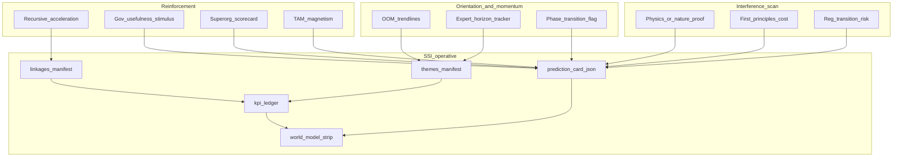

# Courtenay Unified Framework → SSI World Model upgrade

**Date:** 2026-07-23  
**Source (archived):** `_system/reference/investment-wisdom/courtenay/White-Paper-I-A-Unified-Framework-for-Modelling-the-Future.pdf`  
**Text extract:** same folder `…Future.txt`  
**URL:** https://greenash-partners.com/documents/GA-Courtenay/White%20Paper%20I%20A%20Unified%20Framework%20for%20Modelling%20the%20Future(1).pdf  
**Author frame:** GA-Courtenay / Adrian Courtenay, March 18 2026 (39 pp.)

## Goal

Upgrade SSI’s World Model (KPI ledgers + linkages + morning strip) from an **exception-only status light** into a Courtenay-shaped **biophysics of foresight** layer: orientation → interference scan → reinforcement → expected-value stance — without cloning their 20y daily stack, without auto-writing Lawrence base IRR, and without a new mega-framework file.

## Constraints

**Must keep**

- Context-only defaults (`in_base_irr: false`); human promotion for IRR
- Theme CSV + thin manifest storage; front/archive shards
- Existing Lawrence / `valuation.json` / Milly / lint stack
- Monthly (not nightly) World Model CI cadence

**Must not break**

- Nightly `full` intake timing
- Deep-dive prose rules (no IRR math in Business & moat)
- Framework governance (no sprawl; operative JSON + short arsenal/optionality sections)

**Non-goals (explicit)**

- 20-year monthly history for every series
- 60-name “identifiable” watchlist clone
- Automatic base-IRR writes from derived KPIs
- Claiming AGI dates or civilisational forecasts as portfolio truth

## Paper thesis (what Courtenay actually argues)

Prediction accuracy rises when three properties co-occur (surfboard vs freefall):

1. **Initial orientation + momentum** — especially *high-gradient / phase-transition* timing  
2. **Absence of interference** — physics-possible end point, economic viability, regulatory path, controlled failures ≠ falsifiers  
3. **Reinforcement** — recursive tech acceleration, regulatory stimulus (“usefulness filter” / “The Project”), **Superorganisations**, financial magnetism of the goal  

Method stack synthesized from Musk + Aschenbrenner + Courtenay:

| Pillar | Method | Investor use |
|--------|--------|----------------|
| Detect momentum | Frontier proximity; **count OOMs / trendlines before theory**; track whether expert arrival dates are *converging* | Phase-transition flags, not price |
| Bound interference | Physics / natural-world existence proofs; first-principles cost; regulatory transition risk vs level risk | Interference checklist per theme |
| Confirm reinforcement | Recursive build loops; gov stimulus; **5-pillar Superorg**; TAM magnetism | Superorg scorecard on builders |
| Allocate | **Expected value** (p × magnitude), not “will it succeed?”; portfolio across distribution, weight high-EV tails | Stance / sizing language, not single scenario |

**Outside-investor resolution:** Superorganisation recognition substitutes for Musk “contact sport” / Aschenbrenner “situational awareness,” giving the minority holder time, liquidity, hedging, and switching advantages.

## SSI today vs the paper

| Courtenay layer | SSI today | Gap |
|-----------------|-----------|-----|
| Integrated KPI graph | Themes + 6 ledgers + 3 edges; strip shows exceptions only | No orientation / interference / reinforcement structure; **passes invisible** |
| Derivation across tickers | Hyperscaler → land/power; gold; VIX→ICE | Thin; no OOM / expert-horizon / Superorg edges |
| Technocratic resolution | Capex → power → land (ai_power_land) | Missing compute OOMs, power GW, chip capacity, gov stimulus ticks |
| Monthly falsification | Monthly CI + ledgers | Gates are soft floors; not phase-transition falsifiers |
| Superorganisation | Absent as machine-readable object | Highest-ROI conceptual gap |
| Industry-growth nodes | Phase 4 deferred | Needed as thin checklists under themes |
| Dashboard layout | Exception strip only | Needs full graph view: passes, chain, Superorg, EV stance |

## Success criteria

1. Every World Model theme has a **prediction card**: orientation / interference / reinforcement / EV note  
2. Dashboard strip shows **steady with expandable pass ledger** (not empty when healthy)  
3. At least one **Superorganisation scorecard** (pilot: SpaceX-adjacent / AI hyperscaler builders) linked to tagged holdings  
4. At least one **expert-horizon tracker** series (AGI / robotaxi / Starship cadence — public quotes only)  
5. Lint: no silent IRR writes; every new KPI still binds  
6. Agent read load: one short section in `optionality_valuation.md` + linkages README; no new mega `.md` framework

## Proposed architecture



### Operative artifacts (append, don’t parallelize)

| Artifact | Path | Role |
|----------|------|------|
| Prediction card | `_system/reference/world_model/themes/{theme_id}.json` | Orientation / interference / reinforcement / EV (thin checklist + scores) |
| Superorg card | `_system/reference/world_model/superorg/{org_id}.json` | 5-pillar checklist + evidence refs; links to tickers |
| Expert horizons | Theme series or `…/expert_horizons/{domain}.csv` | Arrival-date quotes over time (convergence detector) |
| Ledger enrichment | `{TICKER}/research/kpi_ledger.json` | Optional `prediction_role`: orientation \| interference \| reinforcement |
| Strip v2 | `dashboard/data/world_model.json` | Exceptions **plus** pass summary + theme cards summary |

### Normative home

- Extend `optionality_valuation.md` § World Model (not a new framework file)  
- One arsenal row already exists; expand trigger text  
- Index PDF under `_system/reference/investment-wisdom/courtenay/` (done)

### Dashboard layout (Magis morning strip → foresight cockpit)

**Strip header (always visible)**

- Label: `steady` / `attention` / `broken`  
- Counts: fail / stale / drift / **pass** / ledgers  
- One-line EV stance: “buy dips when orientation+reinforcement hold”

**Expandable panels (below strip)**

1. **Exceptions** (current headlines)  
2. **Pass ledger** — ticker × KPI × actual vs expected (what’s missing when steady)  
3. **Theme chains** — ai_power_land / gold / exchange with OOM arrows  
4. **Superorg board** — 5 pillars traffic lights for 2–4 builders  
5. **Expert horizons** — “years-to-arrival” sparkline / last 3 quote revisions  

**Ticker detail**

- Link from strip row → ledger JSON path + bound valuation path  
- Optional chip on holdings table: `wm:pass` / `wm:fail` for covered names only

## Implementation phases

### Phase A — Visibility (1–2 days) — highest ROI for “why is it zero?”

- Strip shows **pass count** and expandable pass table from `strip.ledgers` + ledger files  
- `build_world_model_snapshot.py` emits `passes[]` (ticker, kpi_id, actual, expected) capped for UI  
- Copy: “Steady means all thesis gates currently hold — expand to inspect”

### Phase B — Prediction cards (theme-level) (3–5 days)

For each existing theme (`ai_power_land`, `gold_royalties`, `exchange_volatility`, `macro_regime`):

```json
{
  "theme_id": "ai_power_land",
  "orientation": {
    "phase_transition": "likely|gradual|unknown",
    "evidence": ["hyperscaler_capex_ttm_usd_bn", "..."],
    "expert_horizons": []
  },
  "interference": {
    "physics_ok": true,
    "economic_viable": true,
    "regulatory": "permissioning|stimulus|uncertain",
    "controlled_failures_note": "..."
  },
  "reinforcement": {
    "recursive": true,
    "gov_stimulus": "rising|flat|falling",
    "superorg_ids": ["nvidia_stack", "spacex_orbit"],
    "tam_magnetism": "high|medium|low"
  },
  "expected_value_note": "context only; informs stance sizing",
  "in_base_irr": false
}
```

Wire snapshot to include card digests in `world_model.json`.

### Phase C — Superorganisation scorecards (1 week)

Pilot 3 orgs (public evidence only):

1. **SpaceX / Starlink stack** (space reinforcement) — link Filtronic / exchange / power names as *downstream* only where already tagged  
2. **Hyperscaler AI builders** (GOOGL/MSFT/META/AMZN as *demand* Superorg proxies via existing `ai_overlay`)  
3. **One portfolio Superorg candidate** from hold book (human picks — e.g. ICE as market-infra compounder, not SpaceX clone)

Five pillars (checklists, not scores that auto-size):

1. Exceptional leadership  
2. Scale beyond individual capacity  
3. Multi-domain specialisation  
4. Efficient coordination / alignment  
5. Tools, network effects, free-riding  

Output: `superorg/{id}.json` + strip panel. Fail a pillar → `[HUMAN REVIEW]` on linked theme card, not IRR rewrite.

### Phase D — Trendline / expert-horizon machinery (1–2 weeks)

- Add theme series: compute OOMs proxies already available (hyperscaler capex; optional power GW when EIA key present)  
- `expert_horizons`: append-only CSV of public arrival-date quotes (domain, speaker, date, years_ahead)  
- Derive `horizon_convergence` (years_ahead declining faster than calendar) → orientation signal  
- Keep evidence tier `public_quote`; never base IRR

### Phase E — Industry nodes (thin) + EV language (ongoing)

- `_system/reference/industry/{node}.json` checklists: capacity, pricing, regulatory ticks  
- Deep-dive / stance prose: optional one sentence “expected value framing” under Payoff (no formulas in exec summary)  
- Monthly ritual checklist updated to walk orientation → interference → reinforcement before price

### Phase F — Gate hardening (after B–D)

- Replace soft floors (e.g. VIX ≥ 12) with **thesis-linked falsifiers** from `growth_explanation` where possible  
- Mark gradual vs phase-transition themes so strip prioritizes phase-transition fails  
- Controlled-failure taxonomy: distinguish “entropic path noise” vs “interference” in ledger status notes

## Risks of simplification / overreach

| Risk | Mitigation |
|------|------------|
| Sprawl of new frameworks | Cards live under `reference/world_model/`; normative = optionality section only |
| AGI / geopolitics cosplay | Expert horizons = quoted tracking only; no fund “AGI by 2027” claim |
| Soft gates forever green | Phase F; human ritual still required |
| Superorg as narrative fluff | Require evidence refs per pillar; lint for empty cards |
| Dashboard clutter | Expandable panels; default collapsed when `steady` |

## Redundancy we keep on purpose

- Milly adversarial pass on deep dives  
- Context overlay lint forbidding IRR key edits  
- Theme offline degrade  
- Human monthly ritual

## Implementation scope checklist

- [x] Source PDF archived + text extract  
- [ ] Docs: optionality § + linkages README + this proposal  
- [ ] Scripts: snapshot passes[]; prediction cards; superorg lint  
- [ ] Dashboard: expandable World Model cockpit  
- [ ] CI: already monthly; extend profile steps for cards  
- [ ] Cursor rules: only if arsenal trigger needs a line  

## Recommended build order (approve to implement)

1. **Phase A** — pass visibility (fixes “why zero?” immediately)  
2. **Phase B** — prediction cards for `ai_power_land` first  
3. **Phase C** — Superorg pilot (hyperscaler demand + one builder)  
4. **Phase D** — expert horizons for AI + space  
5. **Phase E/F** — industry nodes + harder falsifiers  

## Human decisions (resolved 2026-07-23)

1. **First portfolio Superorg:** `ICE` (Intercontinental Exchange). Hold-book name scored on Courtenay’s 5 pillars. “Not SpaceX” means we score a company *you own*, not an external builder like SpaceX. Separate card: `hyperscaler_ai_builders` (demand-side Superorg proxy via GOOGL/MSFT/META/AMZN overlays).  
2. **AGI/robotaxi expert horizons:** yes, `context_only` theme/public-quote series.  
3. **Phases A–F:** approved and implemented (2026-07-23). Snapshot `schema_version` 2.0; strip shows passes/cards/Superorgs/horizons/industry.  
4. **Industry taxonomy (2026-07-23):** 5 nodes = 3 thesis + 2 horizon (`agi`, `robotaxi`). Count/growth rule in `_system/reference/world_model/README.md`. Auto-link to valuation/deep dives: `_system/proposals/world_model_autolink_valuation_2026-07-23.md` (proposal; human-gated).
