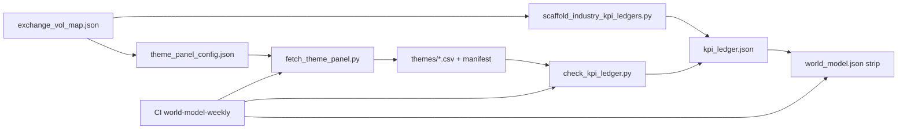

# Plan: Regional exchange volatility ingestion

**Date:** 2026-07-23  
**Status:** implemented (phases 0–4, 2026-07-23)  
**Goal:** For each exchange / market-infra name (e.g. `8697.T`, LSEG, `0388.HK`), ingest a **home-market** volatility KPI through the same theme → ledger → World Model strip path we already use for US VIX / SPY realized vol.  
**Hard rule:** context only; `in_base_irr: false`; no silent IRR edits.

## Problem

Scaffolded `exchange_markets` ledgers all bind to:

- `theme:vix_level` (US)
- `theme:spy_20d_realized_vol` (US)

That mis-measures JPX (`8697.T`), HKEX (`0388.HK`), ASX, London / LSEG, and EU venues. US VIX should remain **global risk** on `macro_regime`, not the home croupier pulse for foreign exchanges.

## Design principles

1. **Reuse the existing ingest stack** — `theme_panel_config.json` → `fetch_theme_panel.py` → theme CSV + `manifest.json` → `kpi_ledger.json` → `check_kpi_ledger.py` → `build_world_model_snapshot.py` → weekly CI.
2. **Home vol first, global vol second** — each exchange ledger gets a regional orientation KPI; optional US VIX as secondary context only.
3. **Robust over perfect** — prefer computed 20d realized vol on the home equity index (Yahoo works today). Add official VI (Nikkei VI, VSTOXX, etc.) only when a stable feed exists.
4. **One mapping table** — single registry of venue → series ids; scaffold and overlays read it; no per-ticker hardcoding sprawl.
5. **Same schedule as other KPIs** — weekly World Model job (`0 16 * * 0` UTC) already runs `fetch_theme_panel.py`.

## Target metric set (v1)

| Series id | Label | Source type | Underlying | Primary tickers |
|-----------|-------|-------------|------------|-----------------|
| `vix_level` | US VIX | existing FRED + `^VIX` | — | ICE, CME, CBOE (+ macro) |
| `spy_20d_realized_vol` | SPY 20d realized % | existing `computed_realized_vol` | SPY | US exchanges |
| `n225_20d_realized_vol` | Nikkei 225 20d realized % | `computed_realized_vol` | `^N225` | **8697.T** |
| `hsi_20d_realized_vol` | Hang Seng 20d realized % | `computed_realized_vol` | `^HSI` (confirm Yahoo) | **0388.HK** |
| `asx200_20d_realized_vol` | ASX 200 20d realized % | `computed_realized_vol` | `^AXJO` (confirm) | **ASX.AX** |
| `ftse_20d_realized_vol` | FTSE 100 20d realized % | `computed_realized_vol` | `^FTSE` | LSEG / London names when onboarded |
| `stoxx50_20d_realized_vol` | Euro Stoxx 50 20d realized % | `computed_realized_vol` | `^STOXX50E` | EU exchange names when onboarded |

**Probed locally (2026-07-23):** `^VIX`, `^N225`, `^FTSE`, `^STOXX50E` fetch OK. Official VI symbols (`^V2TX`, `VS.F`, Yahoo Nikkei VI) failed or looked broken — defer to v2.

### Optional v2 (implied VI when feed stable)

| Series id | Venue | Candidate feed |
|-----------|-------|----------------|
| `nikkei_vi` | Japan | Nikkei 225 VI (official / JPX); only if Yahoo/Stooq/CSV stable |
| `vstoxx` | EU | VSTOXX |
| `vhsi` | Hong Kong | VHSI |

Until then, realized-on-home-index is the production KPI.

## Mapping registry (new thin JSON)

**Path:** `_system/reference/world_model/exchange_vol_map.json`

```json
{
  "schema_version": "1.0",
  "default_region": "US",
  "regions": {
    "US": {
      "implied_vol_series": "vix_level",
      "realized_vol_series": "spy_20d_realized_vol",
      "gate_implied_gte": 12,
      "gate_realized_gte": 8
    },
    "JP": {
      "implied_vol_series": null,
      "realized_vol_series": "n225_20d_realized_vol",
      "gate_realized_gte": 8,
      "note": "Nikkei 225 realized until Nikkei VI feed stable"
    },
    "HK": {
      "implied_vol_series": null,
      "realized_vol_series": "hsi_20d_realized_vol",
      "gate_realized_gte": 8
    },
    "AU": {
      "implied_vol_series": null,
      "realized_vol_series": "asx200_20d_realized_vol",
      "gate_realized_gte": 8
    },
    "UK": {
      "implied_vol_series": null,
      "realized_vol_series": "ftse_20d_realized_vol",
      "gate_realized_gte": 8
    },
    "EU": {
      "implied_vol_series": null,
      "realized_vol_series": "stoxx50_20d_realized_vol",
      "gate_realized_gte": 8
    }
  },
  "ticker_region": {
    "ICE": "US",
    "CME": "US",
    "CBOE": "US",
    "MIAX": "US",
    "OTCM": "US",
    "8697.T": "JP",
    "0388.HK": "HK",
    "ASX.AX": "AU",
    "LSEG.L": "UK",
    "LSE.L": "UK"
  }
}
```

Unresolved tickers on `exchange_markets` industry → fall back to `US` with a scaffold note `[HUMAN REVIEW: region unknown]`.

## Ingest pipeline (same as other KPIs)



### Step A — Theme config

In `theme_panel_config.json` → theme `exchange_volatility`, **add** regional realized series (do not remove US series):

```json
{"id": "n225_20d_realized_vol", "label": "Nikkei 225 20d realized vol (annualized %)",
 "source": "computed_realized_vol", "ticker": "^N225", "window_days": 20, "good_for": "equity_vol_jp"},
{"id": "hsi_20d_realized_vol", "...", "ticker": "^HSI", ...},
{"id": "asx200_20d_realized_vol", "...", "ticker": "^AXJO", ...},
{"id": "ftse_20d_realized_vol", "...", "ticker": "^FTSE", ...},
{"id": "stoxx50_20d_realized_vol", "...", "ticker": "^STOXX50E", ...}
```

Confirm each Yahoo symbol in a one-shot probe before merge (same as today’s `^N225` / `^FTSE` check).

### Step B — Fetch (no new fetcher)

`fetch_theme_panel.py` already implements `computed_realized_vol`. Weekly job + `download_all_holdings` path already call it. No new cron.

**Acceptance:** after fetch, `manifest.json` shows non-null `latest` / `stale: false` for each new series (or `optional: true` + strip does not fail the whole theme).

### Step C — Scaffold / ledger templates

Update `scaffold_industry_kpi_ledgers.py` `exchange_markets` template:

1. Load `exchange_vol_map.json`.
2. For ticker `T` with region `R`:
   - Primary KPI: home `realized_vol_series` (and implied if non-null).
   - **Do not** attach US VIX/SPY as primary for non-US regions.
   - Optional secondary KPI: `vix_level` with `prediction_role: orientation`, note “global risk context only”, softer gate or `stance_only` on fail.
3. `--force-scaffolded` refreshes prior scaffolds; **curated** ICE ledger stays hand-edited (US VIX remains correct).

Also patch existing foreign scaffolds once (`8697.T`, `0388.HK`, `ASX.AX`, …) via a small migration in the scaffold script or one-shot `--force-scaffolded` for exchange tickers only.

### Step D — Check → strip → context

Unchanged:

- `check_kpi_ledger.py --write --mark-auto`
- `build_world_model_snapshot.py`
- `apply_world_model_context.py`

Strip will show e.g. `8697.T | exchange_markets | n225_20d_realized_vol | 12.4 | gte 8`.

### Step E — Holdings themes / industry

- Keep all exchange names on `holdings_themes.exchange_volatility`.
- Industry node `exchange_markets` `linked_kpi_ids` expands to include regional series ids (documentation + strip digests).
- Prediction card `exchange_volatility.json`: note “home-market vol by venue; US VIX is global overlay.”

### Step F — Lint / tests

Add to `test_world_model.py`:

1. Every `ticker_region` key has a folder or is marked watch-only.
2. After offline/fixture fetch, JP ticker ledger source is `theme:n225_20d_realized_vol`, not `theme:vix_level`.
3. Probe list: Yahoo symbols for configured underlyings return ≥20 rows (skip in offline CI if needed with `@pytest.mark.network` equivalent — or a recorded CSV fixture).

### Step G — Docs

- `_system/reference/world_model/README.md` — coverage row for regional vol.
- `_system/reference/linkages/README.md` — one line under operating rules.
- Prediction card + industry `exchange_markets` checklist note.

## Phased delivery

| Phase | Work | Effort | Risk |
|------:|------|--------|------|
| **0** | Probe Yahoo symbols (`^HSI`, `^AXJO`, …); freeze map | S | Low |
| **1** | Add series to `theme_panel_config`; fetch; commit CSVs | S | Low |
| **2** | Add `exchange_vol_map.json`; teach scaffold; re-scaffold foreign exchanges | M | Low |
| **3** | Refresh ledgers + snapshot; verify strip for `8697.T` / `0388.HK` / `ASX.AX` | S | Low |
| **4** | Tests + README; weekly CI picks up automatically | S | Low |
| **5** (later) | Official VI feeds where stable; keep realized as fallback | M | Feed quality |

Phases 0–4 are one focused implementation pass. Phase 5 is optional.

## Gates / thresholds

Start with the same soft floors as US realized (`gte 8` annualized %) unless home-market history shows a different quiet regime (Japan often sits differently than SPY). After 4 weekly snapshots, revisit JP/HK gates with a human note in the map (`gate_realized_gte`).

## Non-goals

- Replacing US VIX on `macro_regime`
- Using regional vol in Lawrence base IRR
- Building a full vol surface / term structure per venue (US already has optional etf-dashboard slope)
- Scraping paid Nikkei/VI terminals in v1

## Success criteria

1. `8697.T` strip KPI is Nikkei-home vol, not US VIX.  
2. `0388.HK` / `ASX.AX` similarly home-mapped.  
3. ICE/CME/CBOE unchanged (US VIX + SPY).  
4. Weekly `world-model-weekly` refreshes the new series without a new cron.  
5. Lint + `test_world_model` green; `in_base_irr` remains false.

## Implementation commands (when approved)

```bash
python _system/scripts/fetch_theme_panel.py
python _system/scripts/scaffold_industry_kpi_ledgers.py --write --force-scaffolded  # or exchange-only flag
python _system/scripts/check_kpi_ledger.py --write --mark-auto
python _system/scripts/lint_kpi_ledger.py
python _system/scripts/build_world_model_snapshot.py --skip-resolve
python _system/scripts/test_world_model.py
```

## Open questions for human

1. Confirm LSEG listing ticker in this registry (`LSEG.L` vs other).  
2. Accept realized-vol v1, or block until official Nikkei VI is wired? **Recommendation: ship realized v1.**  
3. Should non-US ledgers keep a **secondary** US VIX row for global risk, or strip it entirely? **Recommendation: keep secondary, clearly labeled.**
