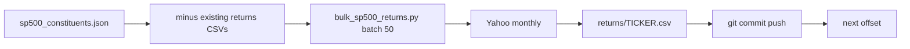

# Bulk S&P 500 returns data (token-efficient batches)

**Date:** 2026-07-09  
**Status:** Plan (ready to execute)  
**Goal:** Add monthly returns CSVs for the ~479 S&P 500 names missing from the returns vault, in batches of 50, commit + push after each batch. Minimal agent tokens.

## Locked scope

**In:** Monthly returns CSVs for S&P names not already in `_system/reference/market-data/returns/`.

**Out:** Registry holdings, ticker folders, SEC/IR PDFs, deep dives, Darwin universe change, dashboard rebuild each batch.

Why this is enough: Darwin’s price panel already loads vault CSVs first (`prices.py` `load_returns_csv` → else Yahoo). Pre-warming the vault for all SPX names prep for a later `sp500_full` sleeve without bloating Marvin.

Gap today: **503** SPX − **24** with returns ≈ **479** missing.

## Token-efficiency rules (for the executing agent)

- One small script; run batches via Shell; do **not** open/read individual CSVs after write.
- Do **not** run `build_dashboard_data.py`, `onboard_ticker.py`, or Marvin refresh.
- Do **not** explore the codebase mid-run; follow this plan.
- After each batch: `git add` only that batch’s paths + status log → commit → push `main`.
- Prefer silent progress files over long chat logs. Agent replies stay 1–2 lines per batch.

## 1. Add bulk fetch script (one-time)

New: `_system/scripts/darwin/bulk_sp500_returns.py`

Reuse existing helpers only:

- Constituents: `_system/reference/market-data/index/sp500_constituents.json`
- Skip if CSV already exists
- Symbol: `yahoo_for_ticker(t, "US")` with `.` → `-` for Yahoo (`BRK.B` → `BRK-B`)
- Fetch: `fetch_yahoo_monthly(ysym, months=120)` from `prices.py`
- Write: same format as `download_ira_research.download_ticker_returns` → `{TICKER with . → _}.csv` under returns dir (`date,monthly_return,source`)
- CLI:

```bash
python _system/scripts/darwin/bulk_sp500_returns.py --batch-size 50 --offset 0 --sleep 1.0
python _system/scripts/darwin/bulk_sp500_returns.py --batch-size 50 --offset 50 --sleep 1.0
# ...
```

Also append JSONL status to `_system/reference/market-data/returns/_sp500_bulk_status.jsonl` (`ticker`, `ok`, `path|error`) so failures are retryable without re-scanning.

Optional Makefile:

```make
darwin-sp500-returns-batch:
	$(PYTHON) $(SCRIPTS)/darwin/bulk_sp500_returns.py --batch-size $(BATCH) --offset $(OFFSET) --sleep 1.0
```

## 2. Batch execution plan (~10 batches)

Missing list sorted alphabetically once at start; offset advances by 50.

| Batch | Offset | Approx tickers | Commit message |
|-------|--------|----------------|----------------|
| 0 | 0 | first 50 | `data(sp500): monthly returns batch 0/N (50 names)` |
| 1 | 50 | next 50 | `data(sp500): monthly returns batch 1/N (50 names)` |
| … | … | … | … |
| last | 450+ | remainder | `data(sp500): monthly returns batch final` |

Per batch (~1–2 wall-clock minutes with 1s sleep):

1. Run script with `--offset` / `--batch-size 50`
2. `git add` only new/updated files under `_system/reference/market-data/returns/` (and the script once in batch 0)
3. Commit + push `main`
4. Advance offset; if Yahoo 429s spike, bump sleep to `1.5` and retry failed tickers once

Roughly **~10 commits / pushes**. Total fetch time ~8–12 minutes plus git/CI overhead.

## 3. Commit / push hygiene

- Stage **only** new/updated files under `_system/reference/market-data/returns/` and the new script (script committed once in batch 0).
- Do not stage unrelated biotech/working-tree dirty files.
- Push to `main` after each commit so history stays incremental.
- Pages deploy is not required for CSV-only data.

## 4. Verification (once at end)

```bash
python -c "from pathlib import Path; import json; sp=json.load(open('_system/reference/market-data/index/sp500_constituents.json')); rem=Path('_system/reference/market-data/returns'); missing=[t for t in sp['tickers'] if not (rem/(t.replace('.','_')+'.csv')).exists()]; print(len(sp['tickers']), 'spx', 'missing', len(missing), missing[:20])"
```

Target: `missing` near 0 (allow a short failed list for delisted/aliases; retry or document in status JSONL).

## 5. Explicit non-goals

- No registry stubs / watchlist for 479 names
- No Darwin `sp500_full` universe change (follow-up)
- No per-ticker agent research prompts (kills token budget)



## Effort estimate

| Work | Time |
|------|------|
| Script + Makefile | ~30–45 min |
| 10 × (fetch + commit + push) | ~15–25 min wall clock |
| Retry failures | ~5–10 min |
| **Total** | **~1 hour**, low agent tokens if batches stay mechanical |
