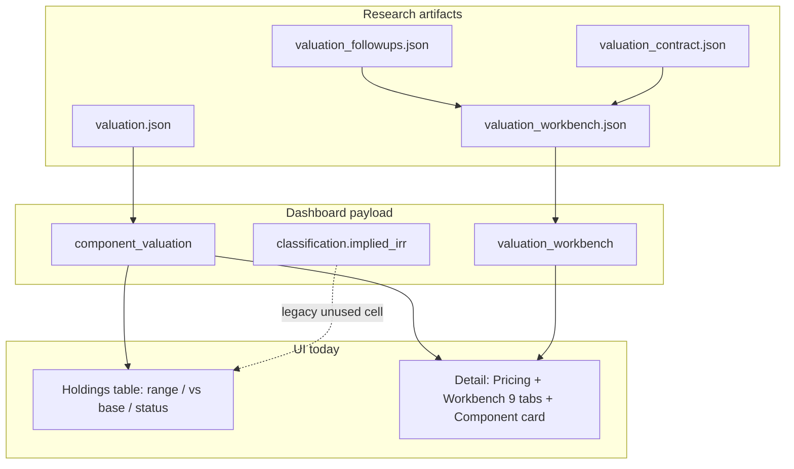

# Valuation status and UI redesign plan

As-of: 2026-07-16  
Related: `_system/prompts/cursor_valuation_evidence_worker.md`, `_system/reference/valuation_followups.json`, `_system/reference/valuation_rollout_queue.md`

## 1. Valuation status

| Layer | State |
|---|---|
| Validation cohort (9) | TPL, LB, WBI, AZLCZ, MSB, C, NVR, NUE, BIIB — all `evidence_blocked` |
| Followups registry | **28** tickers, **82** open gaps, **1** accepted (`MSB/trust_net_assets`) |
| Phase 2 core/hold + sleeves | First-pass inventories written; still evidence-blocked |
| Dashboard coverage | Only **9/634** rows have `component_valuation` + `valuation_workbench` |
| Decision-grade | **None** yet — provisional component schedules exist; acceptance tests mostly open |

Critical inconsistency: holdings table can show **complete** while workbench Decision shows **evidence blocked** (MSB / TPL / LB).

Cohort blockers (still open unless noted):

- **TPL:** tract inventory; water separation; option milestones/capital
- **LB:** Alpha Digital economics; fee-engine unit economics
- **WBI:** project-cohort ROIC; contract quality; refinancing/funding
- **AZLCZ:** ownership waterfalls; residual acreage; water-right realization
- **MSB:** royalty/reserve reconciliation; legal option record; trust net assets **accepted in followups** (workbench still lists unresolved — sync needed)
- **C:** segment RoTCE; distributable capital; stress claims
- **NVR:** owner-earnings cycle; controlled lots; surplus cash
- **NUE:** through-cycle segments; industry capacity; project ROIC
- **BIIB:** product cash flows; pipeline trees; closing claims

## 2. Old vs new viewing model

| Old | New |
|---|---|
| Primary signal: implied IRR % | Primary signal: decision readiness + component value range |
| Optional NAV overlay | Full ownership map of every diluted-share claim |
| “Complete” ≈ schedule filled | “Decision-grade” only after acceptance tests met |
| Committee optional / opaque | Evidence freeze → isolated personas → chair |
| One number culture | Facts / estimates / judgments kept separate |

Users must answer, in order:

1. Decision-grade or evidence-blocked?
2. Value range vs price (provisional?)
3. Which components drive the range?
4. Which acceptance tests remain open?
5. Which power zone / methods apply?
6. Committee progress and owner decision?

Legacy IRR remains a secondary cross-check, not the primary badge language.

## 3. UI changes required

### Phase A — Status truthfulness (ship first)

Files: `dashboard/index.html`, `docs/index.html`; payload in `_system/scripts/build_dashboard_data.py`

1. Replace `renderValuationStatusCell` so it prefers `valuation_workbench.decision.status` (or new slim `valuation_decision.status`).
2. Badge taxonomy:
   - `decision_grade` → green “decision-grade”
   - `evidence_blocked` → amber/red “evidence blocked”
   - component schedule / first-pass only → “provisional”
   - nothing → “missing”
3. Never show “complete” merely because `component_valuation.status === 'complete'`.
4. Subtext: `N critical gaps`.
5. Mark value range provisional when blocked.

### Phase B — Holdings triage

Keep Value range / Price vs base / Valuation columns; add provisional markers and later:

- Filters: decision-grade, evidence-blocked, validation cohort, Phase 2 queue, method profile
- Optional Power zone column

### Phase C — Detail panel composition

Target order:

1. Decision strip (status, price vs base, return, critical gaps, next action, power zone)
2. Valuation workbench (single home)
3. Demote/merge legacy `renderComponentValuation` into Workbench Valuation/Business
4. Pricing analysis as cross-check only
5. Wire or remove unused `renderInvestmentCommittee`

### Phase D — Deepen workbench tabs

| Tab | Add |
|---|---|
| Business | Facts / estimates / judgments lists; overlap keys; falsifiers |
| Valuation | Full component schedule; reverse expectations; causal scenario diffs |
| Evidence | Gap status / progress note; valuation_effect; GitHub path to reconciliation |
| Method fit | routing_reasons, required_evidence, silent_personas |
| Committee | Unresolved items; packet links |
| Optionality | Probability, timing, capital, failure, overlap when present |

Fix tab button vs page order (Evidence / Committee DOM mismatch).

### Phase E — Portfolio Valuation Queue

New view fed by `valuation_followups.json` summarized into `dashboard_data.json`:

- Cohort + expansion waves
- Ticker, profile, decision status, critical gaps, next gap, value exposed
- Click-through to ticker Evidence tab

### Phase F — Data / builder alignment

1. Single status authority: contract/workbench decision status
2. Rebuild MSB workbench after `trust_net_assets` acceptance so unresolved counts match followups
3. Expand `refresh_valuation_dashboard_rows.py` beyond hard-coded 9 as workbenches appear
4. Keep legacy IRR secondary
5. Mirror UI to `docs/` for Pages

### Phase G — Ship order

1. A + F.1–F.2 (stop false “complete”)
2. C (decision strip; demote duplicate card)
3. D Evidence + Business
4. E Valuation Queue
5. B filters + remaining D tabs
6. Widen refresh cohort from followups automatically

## 4. Non-goals

- UI must not mark gaps accepted
- No invented decision-grade from provisional ranges
- No multi-persona voting in one browser form
- Do not block shipping A–C on full 634-ticker workbench coverage

## 5. Success criteria

- No holdings row shows “complete” while `decision.status === evidence_blocked`
- Cohort detail answers readiness, range, components, and open tests without opening JSON
- Valuation Queue matches open critical gaps in followups
- Legacy-only tickers show missing / provisional / legacy IRR — never false complete
