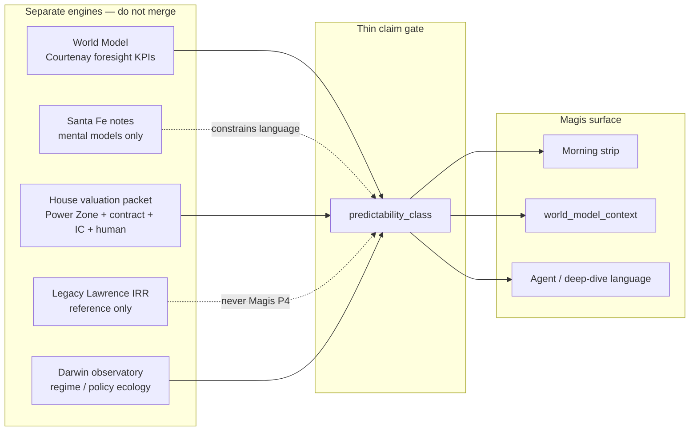

# World Model × Santa Fe — predictability boundaries for Magis

**Date:** 2026-07-24  
**Status:** implemented (Phases 0–5, 2026-07-24)  
**Verdict:** Do **not** merge World Model and Santa Fe into a bigger simulator. Add a **thin predictability class** that gates what Magis is allowed to claim.

**Sources re-read for this plan**

| Layer | Path |
|-------|------|
| Courtenay foresight paper | `_system/reference/investment-wisdom/courtenay/` |
| World Model upgrade + autolink | `courtenay_world_model_upgrade_2026-07-23.md`, `world_model_autolink_valuation_2026-07-23.md` |
| World Model operative | `_system/reference/world_model/README.md`, `dashboard/data/world_model.json` |
| Santa Fe / Arthur corpus | `_system/reference/investment-wisdom/santa-fe/` (+ `notes/_SYNTHESIS_complexity_economics.md`) |
| Darwin / AMH bridge | `darwin_adaptive_principles.md`, `darwin_portfolio_tab_proposal.md` |
| Strip UI | `dashboard/insights-viz.js` → `renderWorldModelStrip` |
| Normative home today | `optionality_valuation.md` § World Model |

---

## 1. Problem

We now have two rich libraries that *sound* like they want to become one engine:

1. **World Model (Courtenay)** — orientation → interference → reinforcement → expected-value stance; KPI ledgers; Superorgs; expert horizons; Magis morning strip.
2. **Santa Fe / Arthur** — economy as evolving complex system; El Farol induction; artificial stock-market regimes; increasing-returns lock-in; “all systems will be gamed.”

The failure mode is obvious and expensive: fuse them into a **mega-simulator** (agent-based market + thesis foresight + AGI dates + IRR), then let Magis speak as if that object were portfolio truth.

That would violate both sources and our stack:

| Source | Already says |
|--------|----------------|
| Courtenay | Determinism is rare; most human paths are surfboard, not freefall; aim for **better probabilities**, not absolute prediction |
| Arthur | Outside equilibrium, rationality/optimum are often **ill-defined**; no closed-form “complexity IRR”; sloppy ABM ≠ rigor |
| SSI hard rules | World Model / Darwin / insider never rewrite universal contracts, Power Zone routes, IC packets, `human_decision.json`, or legacy Lawrence fields |
| Framework governance | No new mega-framework file; append to operative JSON + short arsenal/optionality sections |

**Magis** here means the morning decision surface: Insights World Model strip + ticker context chips + any agent prose that quotes those artifacts. Magis is a **claim publisher**, not a physics engine.

---

## 2. Architecture: three layers, one claim gate

Keep the engines separate. Connect them only through a thin **predictability class**.

| Engine | Job | Owns | Does not own |
|--------|-----|------|--------------|
| **World Model** | Thesis foresight hygiene | Ledgers, theme cards, Superorgs, horizons, strip exceptions/passes | Market ABM, security value, stance |
| **Santa Fe** | Epistemic / formation mental models | Notes under `investment-wisdom/santa-fe/`; claim bans | Operative KPIs, prices, weights |
| **House valuation** | Production value + capital decision | Power Zone route, universal contract, IC, `human_decision.json` (`decision_authority.py`) | Magis forecasts, SFI simulators |
| **Legacy Lawrence** | Specialist / migration reference | Owner-cash IRR math when routed; `implied_return` audit fields | Stance authority, Magis P4 |
| **Darwin** | Adaptive allocation under regimes | Observatory, policies, stress bands | Contract / human decision edits |
| **Predictability class** | What Magis may *say* | Enum + lint + UI badge | New simulator state |

Santa Fe stays a **library**, not a second World Model. Darwin already carries the Lo/Arthur “ecology of strategies” allocation bridge. Do not rebuild that inside `world_model.json`.

---

## 3. Predictability class (the thin object)

### 3.1 Enum (five values — fixed vocabulary)

| Class | Short label | Well-defined question? | Magis may claim | Magis must not claim |
|-------|-------------|------------------------|-----------------|----------------------|
| `P0_ill_defined` | Observe only | No shared model / infinite regress (El Farol) | KPI actuals, open questions, “we do not know path” | Forecasts, EV stance, security value, “will / won’t” |
| `P1_ecology` | Regime | Beliefs co-evolve; attractor may exist | Regime labels, exploration vs calm, crowdedness language | Point price path; “fair value from ecology” |
| `P2_formation` | Lock-in / network | Structure still forming; increasing returns matter | Path dependence, network moat, optionality framing | Score → contract value; inevitability of the winner |
| `P3_oriented` | Orientation-reinforced | Courtenay triad holds *enough* for probabilities | Phase / interference / reinforcement; **EV note**; diligence on gate fails | Deterministic “will happen”; AGI/robotaxi date as portfolio truth |
| `P4_allocation` | House valuation packet | Contract / IC / human path is the claim source | Contract value & return, IC recommendation, human stance/sizing | Treating legacy Lawrence as house; silent rewrite from WM/SFI/Darwin |

**Default demotion rule:** when unsure, use the *lower* class (toward `P0`). Promotion toward `P4` is human-gated via `human_decision.json` (and contract/IC readiness), not via Magis or legacy Lawrence `stance_proposal`.

### 3.2 Assignment map (mechanical defaults)

| Artifact | Default class | Notes |
|----------|---------------|-------|
| KPI strip row (`pass` / `fail` / `stale`) | `P3_oriented` if `prediction_role` set; else `P0_ill_defined` | Fail → diligence copy, not IRR edit |
| Theme prediction card | `P3_oriented` | `in_base_irr` remains false |
| Horizon industry (`agi`, `robotaxi`) + expert horizon CSV | Cap at `P3_oriented` for checklist; **arrival dates** = `P0_ill_defined` | Quotes are observations, not forecasts Magis owns |
| Superorg pillar gaps | `P2_formation` | Formation / coordination, not cash IRR |
| Increasing-returns / network industries (exchanges, hyperscalers, data) | Narrative tag `P2_formation` | Does not replace the universal contract |
| Darwin regime brief / observatory | `P1_ecology` | Already the ecology surface |
| Universal contract + IC + `human_decision.json` | `P4_allocation` | Only surfaces that may drive sizing language |
| Legacy Lawrence `implied_return` / `stance_proposal` | Not Magis P4 | Reference / specialist only (`legacy_reference`) |
| Macro regime card | `P1_ecology` | Cross-cutting; not an industry |

### 3.3 Courtenay ↔ Arthur bridge (words only)

Courtenay’s freefall (orientation + no interference + reinforcement) is the **upper bound** of what Magis may treat as `P3_oriented`. Arthur’s syllogism (fundamental uncertainty → ill-defined problem → undefined optimum) is the **floor** that forces demotion to `P0` / `P1` when the triad breaks or the question is market ecology.

Do **not** encode freefall as a simulated trajectory. Encode it as a **permission** to use probability/EV language.

### 3.4 Forbidden claim patterns (lint targets)

Regardless of class, Magis + agents must never emit:

1. “Complexity IRR” / closed-form return from SFI models  
2. Agent-based stock-market output as house valuation  
3. Horizon arrival dates inside the universal contract or legacy Lawrence ledger  
4. KPI gate pass ⇒ thesis proven / buy signal without `human_decision.json`  
5. Merged “World Model + Santa Fe simulator” status light that implies path certainty  
6. Goodhart-blind KPI worship (Arthur: any performance criterion will be optimized against)  
7. Labeling legacy Lawrence IRR as “house” / Magis P4 when a contract or human decision exists

---

## 4. Dashboard integration (improved Magis plan)

### Design principles (from IA + this verdict)

1. **Single owner per fact** — World Model owns foresight hygiene; Darwin owns regime ecology; Power Zone/contract/IC/human owns house value and stance; Santa Fe owns zero operative numbers; legacy Lawrence is reference-only.
2. **Claim badge before claim text** — every Magis sentence that looks like a forecast shows its class.
3. **Steady ≠ certain** — strip `steady` means gates held, not freefall determinism.
4. **Goodhart panel** — SFI contribution is a checklist, not a model: “who can game this gate?”

### 4.1 Magis strip v2.1 (additive UI — no engine merge)

Keep `renderWorldModelStrip`. Add one header chip and one collapsed panel:

**Header (always visible)**

- Existing: `steady` / `attention` / `broken` + counts  
- **New:** claim ceiling chip — highest class Magis is allowed to use *right now* for thesis language, e.g. `claim ceiling: P3 oriented` or demoted `P1 ecology` when Darwin stress + many WM fails coincide  
- Soften `ev_stance` copy: prefix with class, e.g. `[P3] Buy dips when…` — never bare imperative without class

**New collapsed panel: Claim boundaries**

| Row | Content |
|-----|---------|
| Ceiling | Current Magis claim ceiling + one-line reason |
| Demotions | Artifacts forced to `P0`/`P1` (horizon dates, ill-defined ecology) |
| Goodhart watch | KPI ids flagged as gameable metrics (manual tags first) |
| Engines | Links: World Model · Darwin regime · Contract/IC/human decision · Legacy Lawrence (reference) · SFI notes (docs only) |

**Do not add:** ABM chart, simulated attendance, synthetic price paths, “complexity score.”

### 4.2 Ticker detail

On names with `world_model_context`:

- Chip: `wm:P3` / `wm:P0` (class), keep existing pass/fail  
- One line under World Model context: “Magis claim class: … — context only”  
- Horizon-linked names: show arrival quotes under `P0` label (“public quote, not Magis forecast”)

### 4.3 Darwin tab (leave ecology here)

Answer synthesis Q3 (“frame Magis strip failures as regime/ecology?”) **without** merging:

- When Darwin observatory is in stress / complex regime → Magis claim ceiling **cannot exceed `P1_ecology`** for *market-path* language, even if World Model thesis gates are green.
- World Model fails still open diligence on *thesis* KPIs at `P3` (capacity/pricing/reg), independently of Darwin.
- UI cross-link: strip “Claim boundaries” → Darwin regime brief; Darwin badge → “see Magis claim ceiling.”

### 4.4 Deep-dive / agent prose

| Section | Allowed class language |
|---------|------------------------|
| Business & moat · World Model context | `P3` checklist prose; no IRR math |
| Risks · inversion | `P0`/`P1` uncertainty + Goodhart questions from SFI |
| Payoff | Optional one sentence EV (`P3`) — no formulas in exec summary |
| Valuation (contract / IC / human) | `P4` only; World Model stays context; legacy Lawrence ledger prose must be labeled reference if shown |

Milly adversarial: flag any prose that upgrades class without evidence (e.g. treating robotaxi year as `P4`).

---

## 5. Operative artifacts (append, don’t parallelize)

| Artifact | Path | Change |
|----------|------|--------|
| Class enum + claim matrix | `_system/reference/world_model/predictability_classes.json` | **New** thin JSON (enum, allowed verbs, banned verbs, default map) |
| Theme cards | `world_model/themes/*.json` | Optional `predictability_class` (default `P3_oriented`) |
| Expert horizons | CSV or digest in snapshot | Force `predictability_class: P0_ill_defined` on date fields |
| Snapshot strip | `dashboard/data/world_model.json` | `strip.claim_ceiling`, per-row `predictability_class`, `strip.claim_boundaries` digest |
| `world_model_context` | `{TICKER}/research/valuation.json` | Add `predictability_class` (still `in_base_irr: false`) |
| Industry nodes | `_system/reference/industry/*.json` | Optional `formation_tag: increasing_returns \| diminishing_returns \| mixed` → feeds `P2` narrative only |
| Goodhart tags | ledger KPI `gameability: low\|med\|high` (optional) | Manual; surfaces in Claim boundaries panel |
| Normative text | `optionality_valuation.md` § World Model | +10 lines: class gate + non-merge rule |
| Santa Fe README | `investment-wisdom/santa-fe/README.md` | Point to this proposal; reaffirm “no IRR / no simulator” |
| Lint | extend `lint_kpi_ledger.py` / small `lint_predictability_claims.py` | Banned phrases + class/default consistency |
| Tests | `test_world_model.py` | Ceiling demotion rules; horizons never `P4` |

**No new framework mega-file.** Santa Fe notes remain wisdom; class JSON is operative.

---

## 6. Implementation phases

### Phase 0 — Normative lock (half day)

- Land this proposal.  
- Patch `world_model/README.md`, `santa-fe/README.md`, `optionality_valuation.md` § World Model with: **non-merge + claim class pointer**.  
- Close synthesis open Q4: Darwin docs already cite Arthur + Lo; add one line that Magis uses class gate rather than a second ecology engine.

### Phase 1 — Schema + snapshot fields (1–2 days) — highest ROI

- Add `predictability_classes.json`.  
- `build_world_model_snapshot.py` emits `predictability_class` on passes/fails/cards/horizons + `strip.claim_ceiling`.  
- Defaults from §3.2; Darwin stress optional later (Phase 3).  
- Tests for horizon date demotion and “no P4 on context.”

### Phase 2 — Magis UI (1–2 days)

- Claim ceiling chip + Claim boundaries `
` panel.  
- Relabel `ev_stance` with `[P3]` / demoted class.  
- Copy fix: “Steady means gates held, not path certainty.”  
- Ticker chip `wm:P*`.

### Phase 3 — Cross-engine ceiling (2–3 days)

- Read Darwin observatory JSON when present; if stress/complex → cap market-path ceiling at `P1`.  
- Thesis KPI fails still list under World Model at `P3` diligence.  
- Document the split in strip Claim boundaries (“thesis hygiene vs market ecology”).

### Phase 4 — Goodhart + formation tags (ongoing, thin)

- Manual `gameability` on soft KPI floors (VIX/vol floors first — ASX.AX-style false “broken”).  
- Industry `formation_tag` for exchange / hyperscaler / royalty clusters.  
- Monthly ritual: walk claim ceiling before price (extend World Model ritual; do not add ABM homework).

### Phase 5 — Agent lint (1 day)

- `lint_predictability_claims.py` on deep-dive World Model sections + strip summary strings.  
- Hook into weekly `world-model-weekly` profile (warn, don’t fail CI on prose until stable).

---

## 7. Explicit non-goals

- Santa Fe artificial stock market / El Farol **reimplementation** in this repo  
- Merged “complexity foresight” score that drives weights or IRR  
- Nightly World Model full rebuild (stays weekly)  
- Treating expert-horizon convergence as FCF growth or exit multiple  
- New Krakauer 89-paper ingest as a dependency for Magis  
- Replacing Darwin with World Model ecology language (or vice versa)  
- Auto-promotion of `in_base_irr` from any class other than human/dual-agent promote path already live

---

## 8. Success criteria

1. Magis strip shows a **claim ceiling** and never presents horizon dates as Magis forecasts.  
2. `world_model.json` carries `predictability_class` on context rows; none are `P4_allocation`.  
3. Santa Fe corpus remains wisdom-only; zero new KPIs sourced from Arthur PDFs.  
4. Darwin remains the only ecology/regime *engine*; Magis only *displays* the ceiling interaction.  
5. Lint catches at least the banned phrases in §3.4.  
6. Human can answer in one glance: “What is Magis allowed to claim today?” without opening a simulator.

---

## 9. Why this is a better plan than a merge

| Merge impulse | Better move |
|---------------|-------------|
| One big foresight+ABM engine | Claim class + separate engines |
| “Use Arthur to score themes” | Use Arthur to **forbid** overclaim |
| “Strip failures = complex regime” | Dual signal: WM diligence (`P3`) × Darwin ecology (`P1`) |
| “Courtenay freefall = model it” | Freefall = **permission** for EV language |
| New framework `.md` | Thin `predictability_classes.json` + short optionality paragraph |
| Soft green forever | Goodhart tags + demotion rules + Phase F falsifiers already on WM roadmap |

---

## 10. Human decisions (defaults — confirm to implement)

| # | Decision | Default in this plan |
|---|----------|----------------------|
| 1 | Merge WM + SFI into simulator? | **No** |
| 2 | Operative home for class enum? | `world_model/predictability_classes.json` |
| 3 | Horizon dates class? | Always `P0_ill_defined` |
| 4 | Darwin stress demotes Magis market-path ceiling to `P1`? | **Yes** (Phase 3) |
| 5 | Industry formation tags? | Optional, narrative-only (`P2`) |
| 6 | Soft vol floors (e.g. ASX gate) | Tag `gameability` + review whether fail should be diligence or feed noise |

---

## 11. Recommended build order

1. Phase 0 normative lock  
2. Phase 1 schema + snapshot  
3. Phase 2 Magis UI  
4. Phase 3 Darwin ceiling coupling  
5. Phase 4 Goodhart / formation tags  
6. Phase 5 agent lint  

Approve Phase 0–2 to implement next; Phase 3 needs Darwin field contract check (`darwin_observatory.json` keys) before coding.

---

## 12. Open diligence (agent-resolvable later)

- [ ] Confirm Darwin observatory field names for “stress / complex regime” used in claim-ceiling demotion.  
- [ ] Pilot Goodhart tags on exchange vol floor KPIs (ICE + regional).  
- [ ] One-page claim matrix card in Magis Claim boundaries (generated from JSON, not hand-written HTML).
