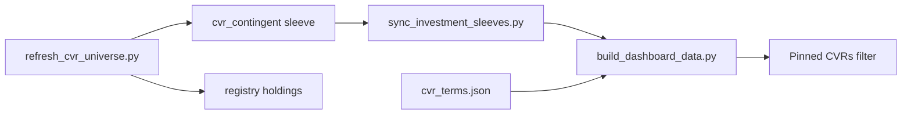

# CVR Agent — Master Plan

**Date:** 2026-07-23  
**Status:** Pipeline live (sleeve + refresh + dashboard filter)  
**Universe registry:** `_system/reference/cvr/cvr_universe.json`  
**Dashboard filter:** pinned **CVRs** (`cvr_all`) after All sleeves

---

## Verdict (confirmed)

1. **Pre-close opportunities** — hunt/size deals with contingent cash while target still trades (`MFBP`).  
2. **Post-close universe** — show onboarded claims (`ABMD.CVR`, `MRTX.CVR`, `PRVL.CVR`).

## Automatic workflow (live)

| Step | Owner |
|------|--------|
| Sync universe → sleeve + registry | `refresh_cvr_universe.py` |
| Classification `investment_sleeve=cvr_contingent` | `sync_investment_sleeves.py` |
| Row payload `cvr` + filter `cvr_all` | `build_dashboard_data.py` |
| Detail panel | `dashboard/index.html` `renderCvrPanel` |
| Nightly hook | `download_all_holdings.daily_refresh` |
| CI hook | `ci_rebuild_profile.expand_steps` |

Optional: `--discover` (SEC) / `--ingest-csv` for new pre-close candidates (context tier until terms filled).

## Phase checklist

- [x] Reference library + term sheets  
- [x] `cvr_universe.json` pre vs post  
- [x] Sleeve `cvr_contingent` + pinned `cvr_all` filter  
- [x] `row["cvr"]` + detail panel  
- [x] `refresh_cvr_universe.py` + CI / nightly hooks  
- [ ] Fairness-opinion extracts (agent diligence on EDGAR)  
- [ ] Live quote → pre-close IRR / p_market for MFBP  
- [ ] Expand pre-close discovery sample once SEC search is stable  

## Dashboard fields

Stage · max contingent · next milestone · p_market / p_marvin · SEC link · terms path

## [PROPOSED MEMORY]

- CVR sleeve = pre-close opportunity funnel + post-close universe display.  
- Dashboard pin: `cvr_all` immediately after All sleeves.  
