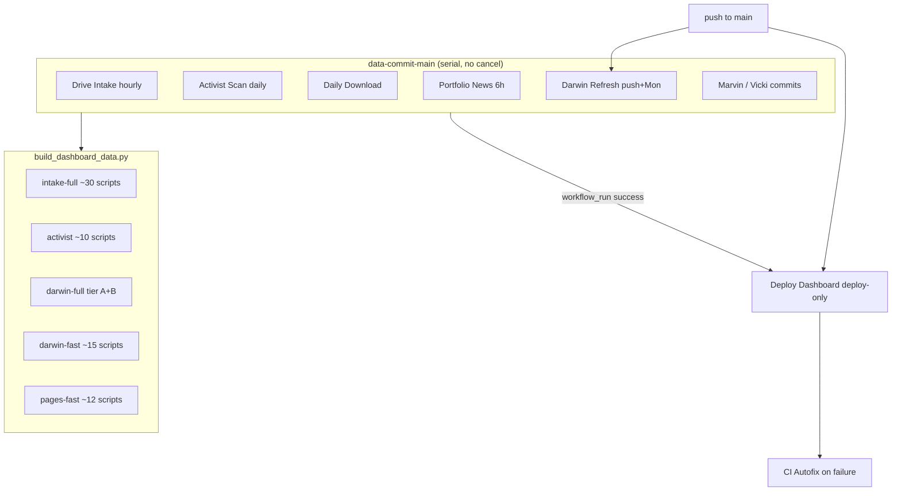
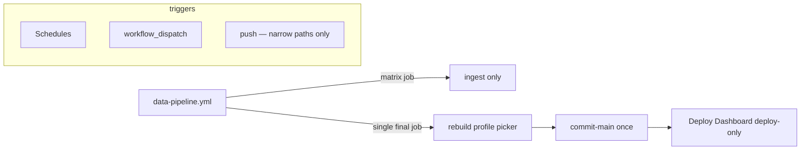

# GitHub Actions consolidation plan

**Date:** 2026-07-12  
**Status:** Implemented 2026-07-12  
**Decisions locked:** Darwin = manual only; Drive Intake = daily; intake-full = nightly (03:00 UTC).  
**Scope:** Reduce CI wall time, queue depth, redundant rebuilds, and runner cost across `magis-capital-partners/single-stock-investments` workflows.

---

## 1. What was stuck (snapshot 2026-07-12 ~18:20 UTC)

### Resolved: Darwin Portfolio Refresh run `29193736669`

| Phase | Duration | Outcome |
|-------|----------|---------|
| `free-disk-space` | ~1 min | OK |
| Bootstrap checkout | ~2 sec | OK |
| **Sparse checkout (`darwin` profile)** | **~5h 01m** | OK but pathological |
| `darwin-full` rebuild | ~12 min | OK |
| **Commit artifacts** | ~4 sec | **FAILED** |

**Root cause (checkout):** `ci_sparse_checkout_paths.py darwin` emits **6,985 paths** (every ticker dir × research/manifest paths). `ci_checkout_workspace.sh` calls `git sparse-checkout add` **once per path** in a shell loop, then `read-tree`. At SPX scale this dominates wall time and looks “stuck” in the UI.

**Root cause (commit):** `ci_push_main.sh` self-synced a newer copy from `origin/main`, `source`d it, and re-invoked `ci_push_main` without the commit message:

```
Syncing ci_push_main.sh from origin/main (conflict resolver update).
_system/scripts/ci_push_main.sh: line 483: 1: commit message required
```

Darwin artifacts were rebuilt on the runner but **never pushed**; dashboard still served from prior commits until later pushes landed.

### Queue / cascade effects (same day)

| Workflow | Pattern | Issue |
|----------|---------|-------|
| **Deploy Dashboard** | `workflow_run` after every data pipeline | Many 6–10s deploy-only runs (good); push-triggered rebuilds **cancelled** while `dashboard-deploy` serializes |
| **Drive Intake Sync** | Hourly + `data-commit-main` | Runs **cancelled** or blocked for 1h+ waiting behind Darwin |
| **CI Autofix** | Fires on every upstream `failure` | Triggered on Darwin failure; adds runner + Cursor API load |
| **Darwin on push** | Every merge touching `valuation.json` / registry | 5h+ runs for work often already committed locally |

**Current state:** Nothing permanently stuck; the pain is **serialization**, **duplicate work**, and **O(n) sparse checkout**.

---

## 2. Architecture today (redundancy map)



### Redundancy hotspots

| # | Problem | Cost |
|---|---------|------|
| R1 | **6,985-path sparse checkout** on `darwin` / `dashboard` profiles | ~5h per job |
| R2 | **`data-commit-main`** serializes 6+ writers; `cancel-in-progress: false` | Hour-long queues |
| R3 | **Push triggers Darwin** when commit already contains `dashboard/data/darwin_*.json` | Full tier A+B download + GA |
| R4 | **Push + workflow_run** both fire Deploy Dashboard for same logical change | Cancelled runs, wasted queue slots |
| R5 | **`darwin-fast` (pages push)** runs 15 scripts including fundamentals, letters, activist feed — overlaps `pages-fast` and `intake-full` slices | 20–40 min duplicate CPU |
| R6 | **Drive Intake hourly** runs full `intake-full` (~30 scripts) even when 0 PDFs imported | Dominant daily runner cost |
| R7 | **`free-disk-space`** on almost every job (often 3× in dashboard-pages) | ~1 min × hundreds of runs/month |
| R8 | **CI Autofix** listens to Deploy Dashboard **success** completions too (noise; most skipped) | Extra workflow_dispatch churn |
| R9 | **Activist scan** in both Drive Intake and Activist Scan Sync | Duplicate SEC work |
| R10 | **`ci_push_main` self-source bug** | Silent push failures after long rebuilds |

---

## 3. Target architecture

**Principle:** *One writer lane, one rebuild orchestrator, deploy-only by default.*



---

## 4. Phased plan

### Phase 0 — Hotfixes (1 PR, <1 day)

**Goal:** Stop 5h checkouts and failed commits immediately.

| Task | Change |
|------|--------|
| **0a** | Fix `ci_push_main.sh`: after `source "$dest"`, do **not** re-run bottom-of-file `ci_push_main "$@"`; or set `CI_PUSH_SKIP_SELF_REFRESH=1` in `commit-main` action |
| **0b** | Replace per-path loop with **batched sparse-checkout**: write paths file → `git sparse-checkout set --stdin` (or cone mode with `_system`, `dashboard`, `docs`, `_external`, and `*/research` glob if Git version supports) |
| **0c** | Add **checkout timeout** (e.g. 15 min) on Darwin job with actionable error |
| **0d** | **Darwin push trigger:** remove `push:` or limit to `_system/scripts/darwin/**` + mandates only (not every `valuation.json` / registry edit) |

**Acceptance:** Darwin scheduled run completes in **<45 min** end-to-end; commit pushes successfully.

---

### Phase 1 — Sparse checkout profiles (1 PR)

**Goal:** Checkout only what each pipeline reads.

| Profile | Current | Proposed |
|---------|---------|----------|
| `darwin` | 6,985 ticker paths | `_system` + `dashboard` + `_external/research-vault` + `_system/reference/market-data` + `_system/portfolio` — **no per-ticker research trees** (Darwin reads `valuation.json` via committed `dashboard/data` and market-data CSVs) |
| `dashboard` | alias of darwin | `pages` + holdings registry JSON only, or reuse `pages` |
| `news` | per-ticker news dirs | keep; holdings-only (~30 paths) not SPX 500 |
| `marvin-pick` | per-ticker research | holdings + `marvin_pick` candidate list file |

Add `ci_sparse_checkout_paths.py --count` to CI smoke test; fail if `darwin` profile > 200 paths.

---

### Phase 2 — Single data orchestrator (1–2 PRs)

**Goal:** Replace competing writers with one workflow.

**New:** `.github/workflows/data-pipeline.yml`

```yaml
# Pseudostructure
on:
  schedule: …
  workflow_dispatch:
    inputs:
      jobs: [drive, activist, news, darwin, downloads]
concurrency:
  group: data-commit-main
  cancel-in-progress: true   # latest wins for scheduled overlap

jobs:
  drive:       # optional matrix / if: schedule hour
  activist:
  news:
  darwin:
  downloads:
  rebuild-and-commit:
    needs: [drive, activist, news, darwin, downloads]
    if: always() && any job produced changes
    steps:
      - detect-changed-paths → pick ONE profile:
          darwin-only     → darwin-full
          docs/registry   → pages-fast
          pdfs/activist   → activist or intake-full
      - commit-main once
```

**Retire or thin:**

| Workflow | Action |
|----------|--------|
| `drive-intake-sync.yml` | Merge into orchestrator; **hourly → every 4h** or only when Drive webhook/flag |
| `activist-scan-sync.yml` | Merge; remove duplicate scan from drive job |
| `darwin-refresh.yml` | **Schedule only** (Mon 12:00 UTC); no push |
| `portfolio-news.yml` | Merge schedule into orchestrator |
| `daily-sync.yml` | Keep Marvin pick separate OR merge downloads job only |

**Acceptance:** At most **one** `git push` to `main` per orchestrator run; queue depth rarely > 1.

---

### Phase 3 — Rebuild profile consolidation (1 PR)

**Goal:** One composable rebuild script instead of 5 copy-pasted lists in `rebuild-data/action.yml`.

**New:** `_system/scripts/ci_rebuild_profile.py`

| Profile | Scripts | When |
|---------|---------|------|
| `minimal` | `build_dashboard_data.py` + validate | Data JSON already fresh |
| `insights` | letters, index_membership, insights, research_memory | News/letters changed |
| `activist` | activist feed + document registry slice | Activist scan |
| `darwin` | download tier A (skip B on non-Mon), `build_darwin_portfolio.py` | Darwin schedule |
| `full` | intake-full (nightly only) | Manual / weekly |

**Delete `darwin-fast`** from pages deploy — pages push should use `minimal` or `insights`, not 15-script mega-profile.

**Drive Intake:** if import count = 0, **skip rebuild** entirely (commit nothing).

---

### Phase 4 — Deploy simplification (1 PR)

| Change | Rationale |
|--------|-----------|
| `dashboard-deploy` → `cancel-in-progress: true` | Only latest site matters |
| Remove `push` from `dashboard-pages.yml` for data paths already covered by orchestrator | Avoid double trigger with Darwin push |
| Keep `workflow_run` → **deploy-only only** (already default via `ci_dashboard_deploy_mode.sh`) | Working well (~6s) |
| `free-disk-space` only when `needs_disk_cleanup=true` (darwin-full, intake-full) | Save ~1 min/job |
| Narrow `workflow_run` upstream list to workflows that **commit dashboard/data** | Skip Marvin Onboard if it opens PRs only |

---

### Phase 5 — CI Autofix tuning (small PR)

| Change | Rationale |
|--------|-----------|
| Remove **Deploy Dashboard** from `workflow_run` triggers | Successes are noise |
| Add `paths-ignore` for known flaky jobs | Optional |
| Only run on `failure` + `cancelled` with duration > 5 min | Skip fast flakes |

---

## 5. Expected impact

| Metric | Today (bad day) | After Phase 0–1 | After Phase 2–4 |
|--------|-----------------|-----------------|-----------------|
| Darwin job wall time | ~5h 15m | ~25–45 min | ~20–30 min |
| Concurrent data writers queued | 3–5 | 1–2 | 1 |
| Dashboard rebuilds per push | 2–3 | 1 | 0–1 (deploy-only) |
| `build_dashboard_data` runs/day | 15–30+ | 8–12 | 4–6 |
| Runner minutes/month (est.) | high | −40% | −60–70% |

---

## 6. Implementation order (recommended)

1. **Phase 0** — unblocks Darwin and stops wasted 5h runs  
2. **Phase 1** — permanent checkout fix  
3. **Phase 4** — quick deploy wins (cancel-in-progress, drop free-disk-space)  
4. **Phase 3** — profile consolidation (reduces script duplication)  
5. **Phase 2** — orchestrator (largest structural change; do after profiles stable)  
6. **Phase 5** — autofix cleanup  

---

## 7. Out of scope (for now)

- Marvin Cloud Agent / deep-dive workflows (different concurrency model; PR-based)
- Research vault clone (keep; needed for IRA tier downloads)
- Moving compute off GitHub Actions to Cloudflare Workers / self-hosted runner
- Deleting `docs/` mirror (separate IA decision)

---

## 8. Decisions (locked 2026-07-12)

1. **Darwin:** manual only (`workflow_dispatch`) — no schedule, no push.  
2. **Drive Intake:** daily (14:00 UTC) via Data Pipeline; skip rebuild/commit when `imported_count=0`.  
3. **Nightly `intake-full`:** 03:00 UTC via Data Pipeline.  
4. **Orchestrator:** `.github/workflows/data-pipeline.yml` (legacy Drive/Activist/News kept as manual fallbacks).  
5. **Tier B IRA download:** remains part of manual Darwin full rebuild.

---

## 9. Verification checklist

After each phase:

```bash
# Local
bash _system/scripts/test_ci_checkout_workspace.sh
python _system/scripts/ci_sparse_checkout_paths.py darwin | wc -l   # target < 200

# CI
gh workflow run "Darwin Portfolio Refresh"
gh run watch
gh run view --log-failed   # commit step must succeed

# Site
curl -sI https://magis-capital-partners.github.io/single-stock-investments/ | head
```

---

## 10. Related files

| File | Role |
|------|------|
| `.github/workflows/*.yml` | Triggers, concurrency |
| `.github/actions/rebuild-data/action.yml` | Profile script lists |
| `_system/scripts/ci_checkout_workspace.sh` | Sparse checkout |
| `_system/scripts/ci_sparse_checkout_paths.py` | Path explosion |
| `_system/scripts/ci_push_main.sh` | Commit push + self-sync bug |
| `_system/scripts/ci_dashboard_deploy_mode.sh` | Deploy-only vs rebuild |
