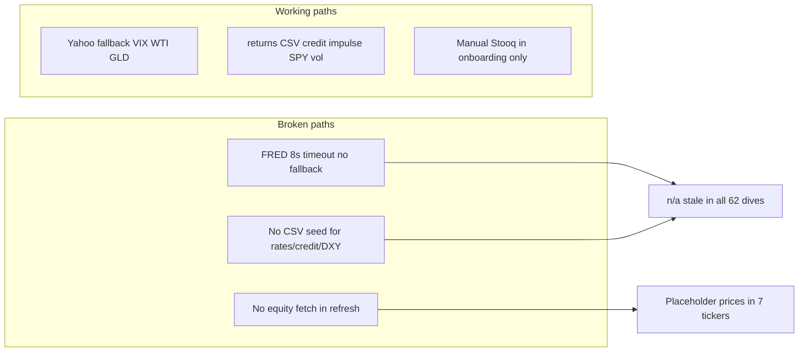

# Market data workflow fix — macro `n/a` + stale equity prices

**Date:** 2026-06-07 (updated)  
**Status:** Plan (pending human review)  
**Trigger:** MSTR deep dive shows `n/a (stale)` for HY OAS, Treasury yields, and DXY; MSTR `inputs.price` is a placeholder ($390) after `marvin_cloud_refresh.py`. User request: add **crypto economics framework** for BTC-exposed tickers, grounded in HK Cryptocurrency Compendium, with live mining-economics metrics.  
**Related:** `_system/reviews/pending/thematic_ingestion_roadmap_2026-06-07.md` (broader theme expansion)

---

## Executive summary

Neither issue is MSTR-specific.

1. **Thematic `n/a` rows** — All holdings tagged `macro_regime` (effectively `*`) inherit the same four null FRED series from `themes/manifest.json`. VIX, credit impulse, and SPY realized vol populate because they use Yahoo or local `returns/` CSVs.
2. **Stale equity price** — `marvin_cloud_refresh.py` never fetches live stock quotes. `fetch_market_inputs.py` is commodity-only (copper for KEWL/MSB). Placeholder prices survive refresh and flow into Lawrence IRR.
3. **No crypto economics layer** — MSTR, GLXY, and CMSG model BTC exposure from filings and placeholders, but there is no live network/mining panel, no `btc_overlay` framework, and no HK Compendium extract in-repo yet.

---

## Diagnosis

### A. Why MSTR shows `n/a (stale)` in thematic context

**Data path:**

```
fetch_theme_panel.py → themes/manifest.json → apply_context_overlay.py
  → valuation.json context_overlay → thematic_context_{date}.md → deep dive
```

**MSTR table (2026-06-07):**

| Indicator | Latest | Source in manifest | Root cause |
|-----------|--------|-------------------|------------|
| HY OAS | n/a (stale) | `fred:BAMLH0A0HYM2` | FRED fetch failed (`error: network`) |
| US Treasury 10Y | n/a (stale) | `fred:DGS10` | same |
| US Treasury 2Y | n/a (stale) | `fred:DGS2` | same |
| Trade-weighted USD | n/a (stale) | `fred:DTWEXBGS` | same |
| VIX | 21.51 | `yahoo:^VIX` | Yahoo fallback works |
| HYG vs TLT 1m spread | 0.27 | `realized_vol` / returns CSV | local compute |
| SPY 20d realized vol | 12.9 | `realized_vol:SPY:20d` | local compute |

**Why FRED fails here:**

- `fetch_fred()` uses 8s timeout (`fetch_theme_panel.py`); cloud agent environment times out on `fred.stlouisfed.org`.
- No Yahoo/etf-dashboard fallback configured for `hy_oas`, `ust_10y`, `ust_2y`, `dxy_broad` in `theme_panel_config.json` (only `vix_level`, `wti_crude`, `gold_spot_usd` have fallbacks today).
- No cached CSV history for failed series (`hy_oas.csv`, `ust_10y.csv`, `ust_2y.csv`, `dxy_broad.csv` absent under `themes/`). Script cannot reuse last-good value.

**Portfolio spot-check (manifest, 2026-06-07):**

| Category | Count | Notes |
|----------|-------|-------|
| FRED series with `latest: null` | **9** | All `error: network` |
| FRED series populated | **0** | Entire FRED layer empty this run |
| Holdings with `macro_regime` overlay | **62** | Tag `"*"` in `holdings_themes.json` |
| Holdings showing same 4 stale macro rows | **62** | Identical manifest slice |

Other theme gaps (same run, not MSTR-only):

- `ai_power_land`: Henry Hub, US electricity price — FRED network
- `exchange_volatility`: VRP health, vol term slope — etf-dashboard path missing (`path_missing` / `no_snapshot`)
- `gold_royalties`: gold spot may use Yahoo fallback; GDX populated

### B. Why MSTR stock price is stale

**Current state (`MSTR/research/valuation.json`):**

```json
"price": 390.0,
"price_source": "Placeholder ~June 2026; confirm via fetch_market_inputs"
```

**Pipeline gap:**

| Step | Fetches equity price? |
|------|----------------------|
| `fetch_market_inputs.py` | **No** — copper/commodities only |
| `fetch_theme_panel.py` | **No** — macro themes only |
| `marvin_valuation.py --write` | **No** — reads existing `inputs.price` |
| `current_book_estimate.py` | Yes (Stooq) — **not wired** into standard refresh |
| `darwin/prices.py` | Yes (Stooq) — used by Darwin, not Marvin refresh |

`marvin_cloud_refresh.py` order today: `fetch_market_inputs` → `marvin_valuation --write` → theme panel. No equity quote step.

**Misleading copy:** `price_source` says "confirm via fetch_market_inputs" but that script cannot update equity price. NVDA/AMD say "marvin_cloud_refresh will update live quote" — also false today.

**Portfolio spot-check (equity prices):**

| Bucket | Tickers | Count |
|--------|---------|-------|
| **Placeholder** (never live-fetched) | AMD, DMLP, MSTR, NBIS, NVDA, SMR, TSLA | **7** |
| **May-dated** (stale >7 days vs 2026-06-07) | AMZN, GOOGL, META, APLD, FRMO, 3905.T, 8697.T, +17 more | **24** |
| **June-dated Stooq/Yahoo** | WPM, TRC, MIAX, RPRX, etc. | majority of rest |

MSTR base IRR **4.2%/yr** and optionality gate (look-through ~$150/sh vs price ~$390) are computed on the placeholder; live price would move stance math materially.

---

## Root causes (systemic)



| # | Root cause | Affected artifacts |
|---|------------|-------------------|
| 1 | FRED-only macro series without fallback or seed cache | `manifest.json`, all `thematic_context_*.md` |
| 2 | Theme fetch marked `optional=True` in refresh — silent failure | No CI gate on null required series |
| 3 | No equity price step in `marvin_cloud_refresh.py` | `valuation.json` `inputs.price`, Lawrence IRR |
| 4 | Onboarding scaffolds use placeholder prices; refresh does not replace | 7 tickers from June batch + DMLP |
| 5 | Misleading `price_source` strings | Human assumes pipeline fixed price |

---

## Fix plan

### Phase 1 — Macro FRED reliability (unblocks all 62 holdings)

**Goal:** Required `macro_regime` series never show `n/a` when any fallback or cache exists.

| Task | File | Detail |
|------|------|--------|
| 1.1 Add Yahoo fallbacks | `theme_panel_config.json` | `ust_10y`: `^TNX` (scale ÷10 if needed); `ust_2y`: `^IRX` or `2YY=F`; `dxy_broad`: `DX-Y.NYB` or `UUP` proxy with note; `hy_oas`: etf-dashboard `HYG`−`TLT` spread or `HYG` yield proxy with **[proxy]** label |
| 1.2 Add etf-dashboard adapter | `fetch_theme_panel.py` | Reuse `etf_metrics_daily.csv` for HYG/TLT/IEF when FRED blocked (roadmap Phase 1A) |
| 1.3 Retry + timeout | `fetch_theme_panel.py` | FRED: 30s timeout, 2 retries, exponential backoff; log error class |
| 1.4 Seed CSV caches | `themes/*.csv` | One-time fetch from network-capable env; commit `ust_10y.csv`, `ust_2y.csv`, `hy_oas.csv`, `dxy_broad.csv` so `--offline` and blocked runs show last-good + `as_of` |
| 1.5 Improve table UX | `apply_context_overlay.py` | When `stale && latest==null`: show `fetch failed (network)` + last cache date if CSV exists; do not print bare `n/a` |
| 1.6 CI gate | `check_market_freshness.py` (new) or extend `lint_context_overlay.py` | Warn if any non-optional `macro_regime` series null and no cache within 10 days |

**Acceptance:** `python3 _system/scripts/fetch_theme_panel.py` → `manifest.json` `macro_regime.ust_10y.latest` non-null; MSTR `thematic_context_*.md` shows yields with `as_of` ≤10 days.

### Phase 2 — Equity price refresh (all holdings)

**Goal:** Every `marvin_cloud_refresh.py` run updates `inputs.price` from live quote before `marvin_valuation.py --write`.

| Task | File | Detail |
|------|------|--------|
| 2.1 New script | `fetch_equity_prices.py` | Input: ticker; read `registry.json` market/exchange; Stooq via `darwin/prices.stooq_symbol()`; Yahoo chart fallback; write `inputs.price`, `price_as_of`, `price_source` |
| 2.2 Wire refresh | `marvin_cloud_refresh.py` | Run `fetch_equity_prices.py {TICKER} --merge` **before** `marvin_valuation.py --write` for every ticker with `valuation.json` |
| 2.3 Batch helper | `batch_portfolio_refresh.py` | Optional `--prices-only` for repair pass |
| 2.4 Human review flag | `valuation.json` | Set `human_review.live_price_confirmed: false` on auto-fetch; human promotes after spot-check |
| 2.5 Fix misleading strings | onboarding templates + existing 7 placeholders | Replace "confirm via fetch_market_inputs" / "marvin_cloud_refresh will update" with actual source pattern: `Stooq {SYMBOL} close {date}` |
| 2.6 FX / pence | `fetch_equity_prices.py` | Reuse patterns from CSU, RMV.L, TEQ.ST manual sources (USDCAD, GBp) |

**Acceptance:** After refresh, MSTR `inputs.price` ≠ 390 placeholder; `price_source` cites Stooq/Yahoo with date; Lawrence `base_pct` recomputed.

### Phase 3 — Lint and pipeline guardrails

| Task | Detail |
|------|--------|
| 3.1 `lint_deep_dive.py` or `check_market_freshness.py` | Error if `price_source` contains `Placeholder`; warn if price `as_of` >7 calendar days |
| 3.2 `marvin_cloud_refresh.py` | Make `fetch_theme_panel.py` **required** (not optional) when ticker has theme tag; exit non-zero if required macro series all null |
| 3.3 `optionality_valuation.md` § Mechanical refresh | Document equity price step + 7-day gate (align with `market-data-freshness.mdc`) |
| 3.4 Milly | Flag `valuation_staleness: price_placeholder` in adversarial YAML |

### Phase 4 — One-time portfolio repair

Run after Phases 1–2 merged:

```bash
# 1. Macro panels (network required once to seed caches)
python3 _system/scripts/fetch_theme_panel.py

# 2. Equity prices for all holdings
python3 _system/scripts/fetch_equity_prices.py --all --merge

# 3. Context overlay for themed holdings
python3 _system/scripts/apply_context_overlay.py

# 4. Full mechanical refresh (recompute IRR + deep dive v2)
python3 _system/scripts/batch_portfolio_refresh.py --date 2026-06-07
```

**Priority tickers:** MSTR, NVDA, AMD, TSLA, SMR, NBIS, DMLP (placeholders) + 24 May-dated names.

---

## Phase 5 — Crypto economics framework + BTC mining metrics

**Goal:** For tickers whose economics or price depend materially on bitcoin, ingest live network and mining-economics data, ground analysis in Horizon Kinetics' Cryptocurrency Compendium, and expose a **context overlay** (never auto-inflate Lawrence base IRR).

**North star (HK / Stahl):** Bitcoin has a **self-equilibrating production cost** — spot price over time reflects mining cost plus incentive margin; difficulty adjustment raises marginal cost of production. Mining economics are the protocol floor context for treasury holders (MSTR) and direct operators (CMSG). See `Stahl-Worth-The-Time-Predictive-Attributes-extract.txt` (mining cost + margin); full treatment in HK Compendium.

### 5A. Wisdom source — HK Cryptocurrency Compendium

| Task | Detail |
|------|--------|
| Vault path | Windows: `C:\Users\werdn\Documents\Investing\Horizon Kinetics\hk_pdfs\Horizon_Kinetics_Cryptocurrency_Compendium.pdf`; cloud: `$HK_PDFS_ROOT` per `hk_paths.json` |
| Extract | Add entry to `hk_extract_manifest.json`; run `refresh_hk_extracts.py` → `_system/reference/investment-wisdom/horizon-kinetics/HK-Cryptocurrency-Compendium-extract.txt` |
| Framework proposal | New triggered doc `_system/frameworks/crypto_economics_valuation.md` (proposal via `architecture_review_template.md` — passes governance: answers decision-stack Q1/Q5, new `btc_overlay` JSON key, lint hook) |
| Agent trigger | Add row to `classification.md` trigger map: `btc_overlay` or `crypto_exposure: treasury | miner | platform` → open `crypto_economics_valuation.md` |

**Compendium sections to index (agent checklist):**

1. Supply protocol (21M cap, halving schedule, difficulty adjustment)
2. Mining as marginal producer (hash rate, electricity, ASIC efficiency)
3. Store-of-value vs speculative demand (ETF flows, exchange volume)
4. Treasury / wrapper equities (mNAV, dilution flywheel — MSTR pattern)
5. Miner operator economics (hashprice, fleet efficiency, power contracts — CMSG pattern)
6. Platform / market-maker cycle (fees, staking, vol marks — GLXY pattern)

### 5B. Affected tickers (initial tag set)

| Ticker | Exposure type | Mining panel use | Lawrence path today |
|--------|---------------|------------------|---------------------|
| **MSTR** | BTC treasury + levered wrapper | Protocol floor context; spot vs look-through NAV; **not** miner breakeven in base IRR | `yield_curve` + `nav_overlay` |
| **GLXY** | Digital-asset platform + treasury marks | Network activity, fee revenue, vol regime | `scenario` + segment build |
| **CMSG** | Miner + treasury (Horizon-affiliated) | **Direct** hashprice vs fleet; network share; power breakeven | `scenario` + approved Substacks |
| **FRMO / HKHC** | Holdco crypto sleeves (optional v2) | Context only; cite FRMO letter extracts | holding_co |

Tag in new `holdings_themes.json` theme `btc_network_economics` and/or per-ticker `crypto_exposure` in `valuation.json`.

**Out of scope v1:** Alt-coins, ETH staking economics, DeFi yields. BTC-only.

### 5C. Data vendor strategy (reputable + Marvin-friendly)

**Recommended stack (tiered):**

| Tier | Source | Metrics | Auth | Rationale |
|------|--------|---------|------|-----------|
| **Primary (mining)** | [mempool.space API](https://mempool.space/docs/api) | Hash rate, difficulty, block reward, avg fees/block, mempool congestion, recommended fees | Free, no key; widely cited | Best open-source mining/network panel; aligns with HK marginal-cost framing |
| **Primary (spot)** | Yahoo `BTC-USD` or CoinGecko free API | BTC USD spot, 24h vol, market cap | Free | Already used in theme panel patterns |
| **Secondary (on-chain)** | Coin Metrics Community API | Active addresses, transfer volume, realized cap | Free tier + API key | Institutional-grade; backup when mempool gaps |
| **Optional (premium)** | Glassnode | Hash ribbons, miner revenue, Puell multiple | Paid `GLASSNODE_API_KEY` | Upgrade path if human approves subscription |
| **Computed** | Marvin scripts | **Hashprice** ($/PH/day), **breakeven power** ($/kWh at assumed J/TH), **subsidy+fee revenue** per EH | Derived from above | Standard miner economics (Braiins / Hashrate Index methodology) |

**Do not use** scraped exchange order books or unaudited social sentiment as base inputs.

**Vault layout:**

```
_system/reference/market-data/crypto/
  manifest.json              # latest values + staleness (mirror themes/)
  btc_spot_usd.csv
  btc_hash_rate_eh.csv
  btc_difficulty.csv
  btc_block_fees_usd.csv
  btc_hashprice_usd_ph_day.csv   # computed
  btc_mining_breakeven_power.csv # computed at reference efficiency tiers
  README.md                  # API keys, rate limits, methodology
```

### 5D. New scripts and config

| Artifact | Purpose |
|----------|---------|
| `crypto_panel_config.json` | Series definitions (id, label, source, optional, fallback, good_for) |
| `fetch_crypto_panel.py` | Fetch BTC network + mining series → CSV cache + `crypto/manifest.json`; `--offline` recompute from cache |
| `compute_mining_economics.py` | Derive hashprice, breakeven $/kWh at 25/30/35 J/TH reference efficiencies; subsidy+fee USD/EH/day |
| `apply_btc_context_overlay.py` | Merge `btc_network_economics` theme into `valuation.json` `btc_overlay` + `evidence/crypto_context_{date}.md` for tagged tickers |
| Wire `marvin_cloud_refresh.py` | After `fetch_equity_prices` (Phase 2), before valuation write: `fetch_crypto_panel.py` then `apply_btc_context_overlay.py` when `crypto_exposure` set |

**`btc_overlay` JSON shape** (mirror `ai_overlay`):

```json
"btc_overlay": {
  "as_of": "YYYY-MM-DD",
  "crypto_exposure": "treasury | miner | platform",
  "status": "partial | complete",
  "in_model": {
    "btc_spot_usd": null,
    "filing_btc_holdings": null,
    "look_through_nav_per_share": null
  },
  "not_in_model_requires_refresh": [
    "live_btc_spot_in_price_input",
    "hashprice_vs_fleet_breakeven",
    "post_halving_subsidy_schedule"
  ],
  "mining_economics_context": {
    "hash_rate_eh": null,
    "difficulty": null,
    "hashprice_usd_ph_day": null,
    "breakeven_power_usd_kwh_30jth": null,
    "fee_share_of_miner_revenue_pct": null,
    "source": "mempool.space + computed"
  },
  "network_regime": "accumulation | distribution | stress",
  "in_base_irr": false
}
```

**Hard rule:** `mining_economics_context` and thematic rows are **context only** (`in_base_irr: false`). Lawrence base stays filing-based owner cash / yield-curve / scenario paths. Human promotes mining-floor or spot-path into base under **[HUMAN REVIEW]**.

### 5E. Framework doc — `crypto_economics_valuation.md` (proposal)

**Decision-stack mapping:**

| Question | Crypto economics answers |
|----------|-------------------------|
| Q1 What is it? | Treasury wrapper vs miner vs platform; BTC as produced commodity with protocol rules |
| Q2 Will it last? | Halving + difficulty path; fleet obsolescence (miners); capital-structure flywheel (MSTR) |
| Q5 Why mispriced? | mNAV premium, hashprice vs power contract, fee-regime shifts, ETF arb |

**Marvin report requirements** (when `btc_overlay` present):

In **Business & moat**, after option scan:

#### `#### Bitcoin economics — model coverage`

| Theme | Latest metric | Filing fact | In base IRR? |
|-------|---------------|-------------|--------------|
| BTC spot vs filing mark | $X (date) | Q1 fair value $64B | no (context) unless price input refreshed |
| Network hash rate / difficulty | EH/s; diff | — | no (context) |
| Hashprice / breakeven power | $/PH/day; $/kWh | CMSG fleet efficiency if disclosed | no (context) |
| Subsidy + fees per EH | USD/day | Post-2024 halving 3.125 BTC/block | no (context) |
| mNAV / wrapper premium (MSTR) | premium % | Look-through ~$150/sh vs price | overlay only |

2–3 sentences linking HK Compendium concept (marginal cost of production, self-equilibrating supply) to the specific ticker.

In **Payoff & return:** one sentence on what changes in bear (hashprice collapse / BTC −40%) vs bull (spot re-rate + sustained fees).

**Milly checks:** `btc_coverage: incomplete` if overlay missing on tagged ticker; flag if `inputs.price` placeholder while `btc_overlay` cites spot; flag if miner ticker lacks hashprice row.

### 5F. Theme panel — `btc_network_economics`

Add to `theme_panel_config.json` + `holdings_themes.json`:

| Series | Source | good_for |
|--------|--------|----------|
| `btc_spot_usd` | Yahoo `BTC-USD` / CoinGecko | all BTC tickers |
| `btc_hash_rate_eh` | mempool.space | miner + treasury context |
| `btc_difficulty` | mempool.space | protocol cost path |
| `btc_avg_fee_per_block_usd` | mempool.space (fees × spot) | miner revenue mix |
| `btc_hashprice_usd_ph_day` | computed | miner breakeven |
| `btc_breakeven_power_30jth` | computed | stress test |
| `btc_subsidy_per_block_btc` | constant 3.125 post-Apr-2024 | halving awareness |
| `btc_etf_netflow_7d_usd` | optional (CoinGlass / Farside — v2) | demand context |

**Consumption:** `apply_btc_context_overlay.py` writes table to `evidence/crypto_context_{date}.md`; `refresh_deep_dive_v2.py` renders `#### Bitcoin economics — model coverage` when `btc_overlay` present (same pattern as thematic context block in thematic roadmap Phase 1C).

### 5G. Deliverables and acceptance

| Deliverable | Acceptance |
|-------------|------------|
| HK Compendium extract in-repo | `HK-Cryptocurrency-Compendium-extract.txt` exists; cited in MSTR dive |
| `crypto/manifest.json` live | `btc_spot_usd`, `btc_hash_rate_eh`, `btc_hashprice_usd_ph_day` non-null, `as_of` ≤7 days |
| MSTR `btc_overlay` seeded | `valuation.json` has overlay; `crypto_context_*.md` populated |
| CMSG mining row | Hashprice + breakeven power in context table; narrative ties to fleet |
| GLXY overlay | Platform framing (fees/vol); mining rows context-only |
| Framework + trigger map | `crypto_economics_valuation.md` + `classification.md` row + optional `.mdc` rule |
| Lint | No `btc_overlay` with `in_base_irr: true` without human edit |

**PR:** `cursor/crypto-economics-framework-94a1` (depends on Phase 2 equity price for MSTR spot tie-out; can parallel Phase 1).

---

## PR sequencing

| Order | Branch | Scope |
|-------|--------|-------|
| **1** | `cursor/macro-fred-fallbacks-94a1` | Phase 1: fallbacks, retry, seed CSVs, overlay UX |
| **2** | `cursor/equity-price-refresh-94a1` | Phase 2: `fetch_equity_prices.py` + refresh wire |
| **3** | `cursor/market-freshness-lint-94a1` | Phase 3: lint + required theme fetch |
| **4** | `cursor/portfolio-market-repair-94a1` | Phase 4: batch repair + MSTR/NVDA/etc IRR updates |
| **5** | `cursor/crypto-economics-framework-94a1` | Phase 5: HK Compendium extract, `fetch_crypto_panel.py`, `btc_overlay`, mining economics |

Phase 1, 2, and 5 can start in parallel; Phase 4 depends on 1–2; Phase 5 proof dives (MSTR, CMSG) depend on 2 for live equity+BTC spot alignment.

---

## Verification matrix

| Check | Command / artifact |
|-------|------------------|
| Macro live | `manifest.json` → `macro_regime.ust_10y.latest` not null |
| MSTR thematic table | No `n/a (stale)` on required macro rows |
| MSTR price | `valuation.json` `price_source` lacks "Placeholder" |
| Portfolio placeholders | 0 tickers with `Placeholder` in `price_source` after repair |
| IRR moved | MSTR `implied_return.base_pct` updated vs $390 placeholder |
| Lint | `make research-check TICKER=MSTR` passes |
| Guardrail | `context_overlay` rows remain `in_base_irr: false` |
| BTC mining panel | `crypto/manifest.json` → hashprice + hash rate populated |
| MSTR crypto section | `#### Bitcoin economics — model coverage` in deep dive |
| HK Compendium | Extract on file; cited in crypto framework proposal |

---

## Risks and mitigations

| Risk | Mitigation |
|------|------------|
| Yahoo/Stooq blocked in CI | Commit seeded CSV caches; etf-dashboard snapshots as second fallback |
| HY OAS proxy ≠ FRED OAS | Label `source` as proxy; context tier only; never base IRR |
| OTC / thin names (AZLCZ, BWEL) | Stooq miss → keep last price + `[HUMAN REVIEW]`; do not overwrite with null |
| IRR churn on price repair | Expected; document in PR; human confirms `live_price_confirmed` |
| Duplicate work with thematic roadmap | This plan is the **incident fix**; roadmap Phase 2 macro_regime is the long-term superset |
| Crypto API rate limits | Cache CSVs daily; `--offline` mode; single fetch per refresh batch |
| Hashprice assumptions | Publish reference J/TH tiers; label `[Assumption]` when fleet efficiency unknown |
| Mining metrics in base IRR | Forbidden without human promotion; Milly flags silent merge |

---

## Open decisions for human

1. **HY OAS proxy:** Accept HYG−TLT spread vs require FRED only with seeded cache?
2. **Price auto-overwrite:** Always refresh price on every `marvin_cloud_refresh`, or only when stale >7 days?
3. **CI network:** Allow outbound FRED/Yahoo in `daily-sync.yml`, or snapshot-only policy?
4. **Placeholder IRR:** Re-run full batch refresh immediately after Phase 2, or ticker-by-ticker human review?
5. **Crypto data vendor:** mempool.space + CoinGecko free tier (recommended) vs Glassnode paid subscription?
6. **HK Compendium:** Human to place PDF in `hk_pdfs` vault for `refresh_hk_extracts.py`, or manual extract upload?
7. **Miner breakeven in overlay:** Show computed industry breakeven only, or require CMSG fleet kWh/TH from filings v2?

---

## Success criteria

- [ ] MSTR (and all holdings) thematic table shows live or cached macro yields/credit/DXY with dated `as_of`
- [ ] Zero placeholder equity prices in `valuation.json` after repair
- [ ] `marvin_cloud_refresh.py` documents and executes equity price fetch before valuation write
- [ ] Lint fails on new placeholder prices; warns on >7-day price staleness
- [ ] Misleading `fetch_market_inputs` copy removed from equity `price_source` fields
- [ ] HK Cryptocurrency Compendium extracted and `crypto_economics_valuation.md` proposed
- [ ] `fetch_crypto_panel.py` populates mining economics (hash rate, hashprice, breakeven power)
- [ ] MSTR, GLXY, CMSG have `btc_overlay` + `crypto_context_*.md` with `in_base_irr: false`
