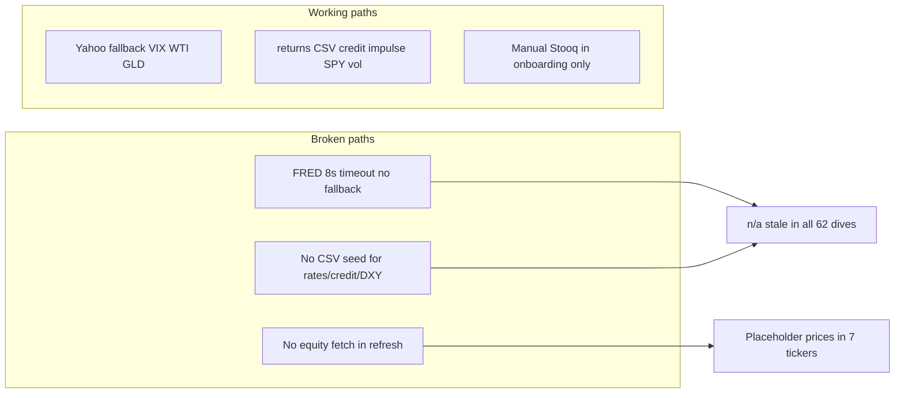

# Market data workflow fix — macro `n/a` + stale equity prices

**Date:** 2026-06-07  
**Status:** Plan (pending human review)  
**Trigger:** MSTR deep dive shows `n/a (stale)` for HY OAS, Treasury yields, and DXY; MSTR `inputs.price` is a placeholder ($390) after `marvin_cloud_refresh.py`.  
**Related:** `_system/reviews/pending/thematic_ingestion_roadmap_2026-06-07.md` (broader theme expansion)

---

## Executive summary

Neither issue is MSTR-specific.

1. **Thematic `n/a` rows** — All holdings tagged `macro_regime` (effectively `*`) inherit the same four null FRED series from `themes/manifest.json`. VIX, credit impulse, and SPY realized vol populate because they use Yahoo or local `returns/` CSVs.
2. **Stale equity price** — `marvin_cloud_refresh.py` never fetches live stock quotes. `fetch_market_inputs.py` is commodity-only (copper for KEWL/MSB). Placeholder prices survive refresh and flow into Lawrence IRR.

---

## Diagnosis

### A. Why MSTR shows `n/a (stale)` in thematic context

**Data path:**

```
fetch_theme_panel.py → themes/manifest.json → apply_context_overlay.py
  → valuation.json context_overlay → thematic_context_{date}.md → deep dive
```

**MSTR table (2026-06-07):**

| Indicator | Latest | Source in manifest | Root cause |
|-----------|--------|-------------------|------------|
| HY OAS | n/a (stale) | `fred:BAMLH0A0HYM2` | FRED fetch failed (`error: network`) |
| US Treasury 10Y | n/a (stale) | `fred:DGS10` | same |
| US Treasury 2Y | n/a (stale) | `fred:DGS2` | same |
| Trade-weighted USD | n/a (stale) | `fred:DTWEXBGS` | same |
| VIX | 21.51 | `yahoo:^VIX` | Yahoo fallback works |
| HYG vs TLT 1m spread | 0.27 | `realized_vol` / returns CSV | local compute |
| SPY 20d realized vol | 12.9 | `realized_vol:SPY:20d` | local compute |

**Why FRED fails here:**

- `fetch_fred()` uses 8s timeout (`fetch_theme_panel.py`); cloud agent environment times out on `fred.stlouisfed.org`.
- No Yahoo/etf-dashboard fallback configured for `hy_oas`, `ust_10y`, `ust_2y`, `dxy_broad` in `theme_panel_config.json` (only `vix_level`, `wti_crude`, `gold_spot_usd` have fallbacks today).
- No cached CSV history for failed series (`hy_oas.csv`, `ust_10y.csv`, `ust_2y.csv`, `dxy_broad.csv` absent under `themes/`). Script cannot reuse last-good value.

**Portfolio spot-check (manifest, 2026-06-07):**

| Category | Count | Notes |
|----------|-------|-------|
| FRED series with `latest: null` | **9** | All `error: network` |
| FRED series populated | **0** | Entire FRED layer empty this run |
| Holdings with `macro_regime` overlay | **62** | Tag `"*"` in `holdings_themes.json` |
| Holdings showing same 4 stale macro rows | **62** | Identical manifest slice |

Other theme gaps (same run, not MSTR-only):

- `ai_power_land`: Henry Hub, US electricity price — FRED network
- `exchange_volatility`: VRP health, vol term slope — etf-dashboard path missing (`path_missing` / `no_snapshot`)
- `gold_royalties`: gold spot may use Yahoo fallback; GDX populated

### B. Why MSTR stock price is stale

**Current state (`MSTR/research/valuation.json`):**

```json
"price": 390.0,
"price_source": "Placeholder ~June 2026; confirm via fetch_market_inputs"
```

**Pipeline gap:**

| Step | Fetches equity price? |
|------|----------------------|
| `fetch_market_inputs.py` | **No** — copper/commodities only |
| `fetch_theme_panel.py` | **No** — macro themes only |
| `marvin_valuation.py --write` | **No** — reads existing `inputs.price` |
| `current_book_estimate.py` | Yes (Stooq) — **not wired** into standard refresh |
| `darwin/prices.py` | Yes (Stooq) — used by Darwin, not Marvin refresh |

`marvin_cloud_refresh.py` order today: `fetch_market_inputs` → `marvin_valuation --write` → theme panel. No equity quote step.

**Misleading copy:** `price_source` says "confirm via fetch_market_inputs" but that script cannot update equity price. NVDA/AMD say "marvin_cloud_refresh will update live quote" — also false today.

**Portfolio spot-check (equity prices):**

| Bucket | Tickers | Count |
|--------|---------|-------|
| **Placeholder** (never live-fetched) | AMD, DMLP, MSTR, NBIS, NVDA, SMR, TSLA | **7** |
| **May-dated** (stale >7 days vs 2026-06-07) | AMZN, GOOGL, META, APLD, FRMO, 3905.T, 8697.T, +17 more | **24** |
| **June-dated Stooq/Yahoo** | WPM, TRC, MIAX, RPRX, etc. | majority of rest |

MSTR base IRR **4.2%/yr** and optionality gate (look-through ~$150/sh vs price ~$390) are computed on the placeholder; live price would move stance math materially.

---

## Root causes (systemic)



| # | Root cause | Affected artifacts |
|---|------------|-------------------|
| 1 | FRED-only macro series without fallback or seed cache | `manifest.json`, all `thematic_context_*.md` |
| 2 | Theme fetch marked `optional=True` in refresh — silent failure | No CI gate on null required series |
| 3 | No equity price step in `marvin_cloud_refresh.py` | `valuation.json` `inputs.price`, Lawrence IRR |
| 4 | Onboarding scaffolds use placeholder prices; refresh does not replace | 7 tickers from June batch + DMLP |
| 5 | Misleading `price_source` strings | Human assumes pipeline fixed price |

---

## Fix plan

### Phase 1 — Macro FRED reliability (unblocks all 62 holdings)

**Goal:** Required `macro_regime` series never show `n/a` when any fallback or cache exists.

| Task | File | Detail |
|------|------|--------|
| 1.1 Add Yahoo fallbacks | `theme_panel_config.json` | `ust_10y`: `^TNX` (scale ÷10 if needed); `ust_2y`: `^IRX` or `2YY=F`; `dxy_broad`: `DX-Y.NYB` or `UUP` proxy with note; `hy_oas`: etf-dashboard `HYG`−`TLT` spread or `HYG` yield proxy with **[proxy]** label |
| 1.2 Add etf-dashboard adapter | `fetch_theme_panel.py` | Reuse `etf_metrics_daily.csv` for HYG/TLT/IEF when FRED blocked (roadmap Phase 1A) |
| 1.3 Retry + timeout | `fetch_theme_panel.py` | FRED: 30s timeout, 2 retries, exponential backoff; log error class |
| 1.4 Seed CSV caches | `themes/*.csv` | One-time fetch from network-capable env; commit `ust_10y.csv`, `ust_2y.csv`, `hy_oas.csv`, `dxy_broad.csv` so `--offline` and blocked runs show last-good + `as_of` |
| 1.5 Improve table UX | `apply_context_overlay.py` | When `stale && latest==null`: show `fetch failed (network)` + last cache date if CSV exists; do not print bare `n/a` |
| 1.6 CI gate | `check_market_freshness.py` (new) or extend `lint_context_overlay.py` | Warn if any non-optional `macro_regime` series null and no cache within 10 days |

**Acceptance:** `python3 _system/scripts/fetch_theme_panel.py` → `manifest.json` `macro_regime.ust_10y.latest` non-null; MSTR `thematic_context_*.md` shows yields with `as_of` ≤10 days.

### Phase 2 — Equity price refresh (all holdings)

**Goal:** Every `marvin_cloud_refresh.py` run updates `inputs.price` from live quote before `marvin_valuation.py --write`.

| Task | File | Detail |
|------|------|--------|
| 2.1 New script | `fetch_equity_prices.py` | Input: ticker; read `registry.json` market/exchange; Stooq via `darwin/prices.stooq_symbol()`; Yahoo chart fallback; write `inputs.price`, `price_as_of`, `price_source` |
| 2.2 Wire refresh | `marvin_cloud_refresh.py` | Run `fetch_equity_prices.py {TICKER} --merge` **before** `marvin_valuation.py --write` for every ticker with `valuation.json` |
| 2.3 Batch helper | `batch_portfolio_refresh.py` | Optional `--prices-only` for repair pass |
| 2.4 Human review flag | `valuation.json` | Set `human_review.live_price_confirmed: false` on auto-fetch; human promotes after spot-check |
| 2.5 Fix misleading strings | onboarding templates + existing 7 placeholders | Replace "confirm via fetch_market_inputs" / "marvin_cloud_refresh will update" with actual source pattern: `Stooq {SYMBOL} close {date}` |
| 2.6 FX / pence | `fetch_equity_prices.py` | Reuse patterns from CSU, RMV.L, TEQ.ST manual sources (USDCAD, GBp) |

**Acceptance:** After refresh, MSTR `inputs.price` ≠ 390 placeholder; `price_source` cites Stooq/Yahoo with date; Lawrence `base_pct` recomputed.

### Phase 3 — Lint and pipeline guardrails

| Task | Detail |
|------|--------|
| 3.1 `lint_deep_dive.py` or `check_market_freshness.py` | Error if `price_source` contains `Placeholder`; warn if price `as_of` >7 calendar days |
| 3.2 `marvin_cloud_refresh.py` | Make `fetch_theme_panel.py` **required** (not optional) when ticker has theme tag; exit non-zero if required macro series all null |
| 3.3 `optionality_valuation.md` § Mechanical refresh | Document equity price step + 7-day gate (align with `market-data-freshness.mdc`) |
| 3.4 Milly | Flag `valuation_staleness: price_placeholder` in adversarial YAML |

### Phase 4 — One-time portfolio repair

Run after Phases 1–2 merged:

```bash
# 1. Macro panels (network required once to seed caches)
python3 _system/scripts/fetch_theme_panel.py

# 2. Equity prices for all holdings
python3 _system/scripts/fetch_equity_prices.py --all --merge

# 3. Context overlay for themed holdings
python3 _system/scripts/apply_context_overlay.py

# 4. Full mechanical refresh (recompute IRR + deep dive v2)
python3 _system/scripts/batch_portfolio_refresh.py --date 2026-06-07
```

**Priority tickers:** MSTR, NVDA, AMD, TSLA, SMR, NBIS, DMLP (placeholders) + 24 May-dated names.

---

## PR sequencing

| Order | Branch | Scope |
|-------|--------|-------|
| **1** | `cursor/macro-fred-fallbacks-94a1` | Phase 1: fallbacks, retry, seed CSVs, overlay UX |
| **2** | `cursor/equity-price-refresh-94a1` | Phase 2: `fetch_equity_prices.py` + refresh wire |
| **3** | `cursor/market-freshness-lint-94a1` | Phase 3: lint + required theme fetch |
| **4** | `cursor/portfolio-market-repair-94a1` | Phase 4: batch repair + MSTR/NVDA/etc IRR updates |

Phase 1 and 2 can ship in parallel; Phase 4 depends on both.

---

## Verification matrix

| Check | Command / artifact |
|-------|------------------|
| Macro live | `manifest.json` → `macro_regime.ust_10y.latest` not null |
| MSTR thematic table | No `n/a (stale)` on required macro rows |
| MSTR price | `valuation.json` `price_source` lacks "Placeholder" |
| Portfolio placeholders | 0 tickers with `Placeholder` in `price_source` after repair |
| IRR moved | MSTR `implied_return.base_pct` updated vs $390 placeholder |
| Lint | `make research-check TICKER=MSTR` passes |
| Guardrail | `context_overlay` rows remain `in_base_irr: false` |

---

## Risks and mitigations

| Risk | Mitigation |
|------|------------|
| Yahoo/Stooq blocked in CI | Commit seeded CSV caches; etf-dashboard snapshots as second fallback |
| HY OAS proxy ≠ FRED OAS | Label `source` as proxy; context tier only; never base IRR |
| OTC / thin names (AZLCZ, BWEL) | Stooq miss → keep last price + `[HUMAN REVIEW]`; do not overwrite with null |
| IRR churn on price repair | Expected; document in PR; human confirms `live_price_confirmed` |
| Duplicate work with thematic roadmap | This plan is the **incident fix**; roadmap Phase 2 macro_regime is the long-term superset |

---

## Open decisions for human

1. **HY OAS proxy:** Accept HYG−TLT spread vs require FRED only with seeded cache?
2. **Price auto-overwrite:** Always refresh price on every `marvin_cloud_refresh`, or only when stale >7 days?
3. **CI network:** Allow outbound FRED/Yahoo in `daily-sync.yml`, or snapshot-only policy?
4. **Placeholder IRR:** Re-run full batch refresh immediately after Phase 2, or ticker-by-ticker human review?

---

## Success criteria

- [ ] MSTR (and all holdings) thematic table shows live or cached macro yields/credit/DXY with dated `as_of`
- [ ] Zero placeholder equity prices in `valuation.json` after repair
- [ ] `marvin_cloud_refresh.py` documents and executes equity price fetch before valuation write
- [ ] Lint fails on new placeholder prices; warns on >7-day price staleness
- [ ] Misleading `fetch_market_inputs` copy removed from equity `price_source` fields
