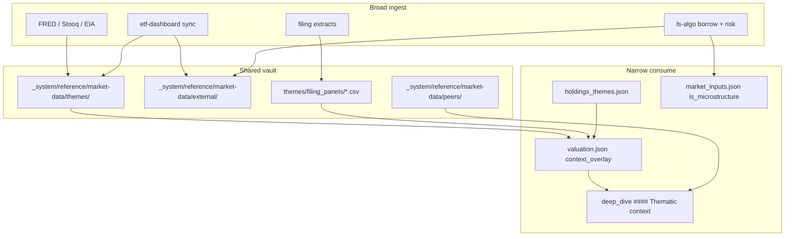

# Thematic data ingestion — implementation roadmap

**Date:** 2026-06-07  
**Status:** Plan (pending human review)  
**Scope:** Items 1, 4, 5, 6, 8, 9, 10 from post-PR#108 next steps  
**North star:** Broadly ingest context (macro, etf-dashboard, filings, L/S plumbing); consume narrowly (tagged holdings + peer panels); never auto-inflate Lawrence base IRR.

---

## Current baseline (what exists on `main`)

| Layer | Shipped (PR #108) | Gap |
|-------|-------------------|-----|
| Theme fetch | `fetch_theme_panel.py` + `theme_panel_config.json` (`ai_power_land` only) | Macro FRED/Stooq series null on offline seed; only hyperscaler capex populated |
| Tags | `holdings_themes.json` → TPL, LB, WBI, APLD, BWEL | AZLCZ not tagged |
| Consumption | `context_overlay` in `valuation.json` + `thematic_context_{date}.md` | Not rendered in deep dives; manual citation only |
| External bridge | `darwin/import_external_data.py` syncs etf-dashboard → `_system/reference/market-data/external/` | Not wired into theme panels or per-holding `market_inputs` |
| Filing extracts | `filing_facts.py`, `build_filing_evidence.py` | No theme-specific time series (TPL water YoY, AZLCZ lease ramp) |
| L/S | `borrow_spike_risk.json` (etf-dashboard) | YB-focused symbols; not mapped to registry holdings |
| Peers | None | No `_system/reference/market-data/peers/` |
| PR lint | `lint_pr_research.py` lints any ticker with `*/research/*` in diff | Mechanical `context_overlay` edits trigger full deep-dive lint (BWEL lesson) |

**etf-dashboard files already bridged** (via `external_sources.py`):

- `etf_metrics_daily.csv` — daily ETF prices/metrics (observatory returns today)
- `borrow_spike_risk.json` — borrow spike model per symbol
- `vrp_health.json` / `vrp_live.json` — options vol health
- `macro_event_calendar.json` — FOMC/CPI dates
- `vol_shape_history.json` — vol term structure history

**ls-algo** (sibling): `risk_dashboard/data/latest.json` — book gross/net, breaches, scenario shocks.

---

## Target architecture



**Hard rule (unchanged):** `context_overlay` and thematic tables are **context only** (`in_base_irr: false` default). Human promotes under **[HUMAN REVIEW]**.

---

## Phase 1 — Macro series live + deep-dive use (Items 1 & 4)

**Goal:** Populate at least one live macro series in `themes/manifest.json` and show it in TPL + AZLCZ deep dives.

### 1A. Macro series populate (Item 1)

| Task | Detail |
|------|--------|
| CI network check | Confirm `daily-sync.yml` job can reach `fred.stlouisfed.org` and `stooq.com` after `fetch_theme_panel.py` |
| Pick proof series | **WTI (`DCOILWTICO`)** — ties TPL Permian royalties + AZ energy context; single series proves pipeline |
| Fallback | If FRED blocked in CI, add `etf_dashboard` source type: pull **XLE** or **USO** close from `etf_metrics_daily.csv` as WTI proxy |
| Extend `fetch_theme_panel.py` | New source block: `{"source": "etf_dashboard", "etf_dashboard_file": "etf_metrics_daily.csv", "ticker": "XLE", "column": "underlying_adj_close"}` |
| Wire daily sync | Already in `download_all_holdings.py`; add `darwin-refresh.yml` optional theme refresh after `import_external_data.py` |
| Acceptance | `themes/manifest.json` shows `wti_crude.latest` non-null with `as_of` within 10 days |

### 1B. Tag AZLCZ

Add to `holdings_themes.json`:

```json
"ai_power_land": {
  "tickers": ["TPL", "LB", "WBI", "APLD", "BWEL", "AZLCZ"]
}
```

Rationale: AZLCZ renewable lease ramp is a **downstream beneficiary** of datacenter/grid power demand (Groundbreaker thesis); same upstream pulse (hyperscaler capex, electricity price). Geography differs (Arizona vs Permian) but chain is shared.

Optional sub-note in theme description: Permian names vs Southwest renewable surface.

### 1C. Deep-dive consumption (Item 4)

**Mechanical render** (preferred over hand-editing only):

| Task | File | Pattern |
|------|------|---------|
| Add `thematic_context_business_block()` | `refresh_deep_dive_v2.py` | Mirror `ai_infrastructure_business_block()` |
| Insert after Business & moat segment map | same | `#### Thematic context` table from `valuation.json` `context_overlay` |
| Lint rule | `lint_deep_dive.py` | **Warn** (not error) if `context_overlay` present but section missing |
| Narrative paragraph | Marvin agent pass on TPL + AZLCZ | 2–3 sentences linking indicators to water/lease optionality; **not** in base IRR |

**TPL deep dive content (narrative, one paragraph in Business & moat):**

- Hyperscaler capex **467 bn** → power/water constraint → TPL water revenue **$307.5M** (+16% YoY) as midstream proof
- WTI direction vs prior year as Permian royalty volume/cash context
- Explicit: "in overlay math? **no (context)**" for each row

**AZLCZ deep dive content:**

- Same upstream capex + electricity price table
- Link to renewable lease ramp (AES/Invenergy) as **surface monetization** of power-demand tailwind
- Cross-ref Groundbreaker (approved) as context tier, not base IRR input

### 1D. Deliverables

- [ ] `themes/wti_crude.csv` with ≥30 days history
- [ ] `TPL/research/deep_dive_{date}.md` with `#### Thematic context` (mechanical + narrative)
- [ ] `AZLCZ/research/deep_dive_{date}.md` with same + `context_overlay` seeded
- [ ] `python lint_deep_dive.py TPL AZLCZ` passes

**PR:** `cursor/thematic-macro-dive-tpl-azlcz-3b39`

---

## Phase 2 — Theme expansion (Step 5)

Add three theme layers in `theme_panel_config.json` + `holdings_themes.json`.

### Theme: `macro_regime` (all holdings)

| Series | Source | Use |
|--------|--------|-----|
| HY OAS | FRED `BAMLH0A0HYM2` | Risk appetite |
| 10Y / 2Y | FRED | Rates regime |
| DXY | FRED `DTWEXBGS` | Dollar |
| VIX proxy | etf-dashboard `etf_metrics_daily` **VIXY** or FRED `VIXCLS` | Vol regime |
| Credit impulse | HYG vs TLT 1m return spread from `etf_metrics_daily` | **etf-dashboard** |

**Tags:** `registry.json` all holdings (or `holdings_themes.json` `"tickers": ["*"]` resolved in `apply_context_overlay.py`).

**Consumption:** Optional one-row summary in deep dives; primary use = Darwin `features.py` regime label later.

### Theme: `gold_royalties`

| Series | Source | Tags |
|--------|--------|------|
| Gold spot | Stooq / FRED `GOLDAMGBD228NLBM` | RGLD, FNV, WPM, OR, MSB |
| GDX | etf-dashboard `etf_metrics_daily` | same |
| GDX/GLD ratio (computed) | themes script | royalty multiple sentiment |
| Copper (existing) | `fetch_market_inputs.py` | MSB, KEWL |

### Theme: `exchange_volatility`

| Series | Source | Tags |
|--------|--------|------|
| VIX level | FRED / VIXY | CME, ICE, CBOE, MIAX, 8697.T |
| MOVE proxy | FRED `MOVE` if available else `TLT` vol from etf_metrics | same |
| SPY 20d realized vol | computed from `etf_metrics_daily` SPY | croupier fee tailwind context |
| `vol_shape_history.json` | etf-dashboard snapshot → themes manifest | vol term structure regime |

### Implementation notes

- Extend `fetch_theme_panel.py` with `source: etf_dashboard` adapter (read CSV, emit daily series)
- Call `sync_external_market_data()` at start of `fetch_theme_panel.py` so etf paths resolve
- New env: `DARWIN_ETF_DASHBOARD_ROOT` documented in `themes/README.md`

**PR:** `cursor/theme-layers-macro-gold-exchange-3b39`

---

## Phase 3 — Filing-derived panels (Step 6)

**Goal:** Time series from PDFs we already own, not external vendors.

### New script: `extract_theme_facts.py`

| Panel | Tickers | Extract from | Output |
|-------|---------|--------------|--------|
| `ai_capex_quarterly.csv` | GOOGL, AMZN, META, MSFT | `ai_overlay` + 10-K `_text` capex lines | Quarterly capex USD bn |
| `tpl_operating_panel.csv` | TPL | 10-K/Q segment notes | water_revenue, royalty_revenue, easement_count, OCF |
| `azlcz_lease_panel.csv` | AZLCZ | Annual report Note 10 + `_text` | renewable_revenue, grazing_revenue, shares_outstanding |
| `permian_surface_panel.csv` | LB, TPL | 10-K easement / NRA disclosures | easements_new, water_revenue |

**Parser strategy (simplest first):**

1. Reuse `filing_facts.py` / regex on `_text/` extracts (no new OCR)
2. Append rows to `themes/filing_panels/{panel}.csv` with `as_of`, `source_path`
3. `fetch_theme_panel.py` merges filing panels into manifest under `source: filing_panel`

**Wire:** Run after `build_filing_evidence.py` in `download_all_holdings.py` and `marvin_cloud_refresh.py`.

**AZLCZ priority:** Addresses gap in `module_improvement_plan_land_royalty_2026-06-05.md` (lease schedule) at MVP level: annual renewable revenue series, not full project graph yet.

**TPL priority:** Water revenue YoY in manifest → cite in thematic context table.

**PR:** `cursor/filing-theme-panels-3b39`

---

## Phase 4 — L/S microstructure (Step 8)

**Goal:** Per-holding borrow/liquidity context for L/S book, holdings-scoped.

### Data sources

| Field | Primary source | Fallback |
|-------|----------------|----------|
| `borrow_fee` / spike risk | etf-dashboard `borrow_spike_risk.json` `symbols.{ticker}` | null + note |
| `short_interest_pct` | Future: etf-dashboard extension or manual CSV | skip v1 |
| `adv_shares_20d` | Stooq daily volume × close | `darwin/prices.py` |
| `spread_bps` | [Assumption] half spread from ADV tier | mandate default |
| `vol_regime` | `vrp_health.json` + `vol_shape_history` | context only |

### New script: `fetch_ls_microstructure.py`

- Input: `registry.json` holdings
- Map registry ticker → etf-dashboard symbol (config file `ls_symbol_map.json`; most holdings won't match borrow model — that's OK)
- Write `{TICKER}/research/market_inputs.json` block:

```json
"ls_microstructure": {
  "borrow_spike_5d": 0.02,
  "risk_band": "low",
  "adv_usd_20d": 1200000,
  "as_of": "2026-06-07",
  "source": "etf-dashboard:borrow_spike_risk"
}
```

- Merge into `context_overlay` or separate `market_inputs` (prefer **market_inputs** to avoid PR lint on valuation-only overlay)

### etf-dashboard extension (optional, sibling repo)

If borrow model doesn't cover TPL/AZLCZ/OTC names, document **coverage gap** in manifest; use ADV-only tier for illiquid names (7176.T pattern).

**Wire:** `download_all_holdings.py` after theme panel; `marvin_cloud_refresh.py` for all holdings.

**PR:** `cursor/ls-microstructure-ingest-3b39`

---

## Phase 5 — Peer panels (Step 9)

**Goal:** Small comp sets for relative value, not 15k universe.

### Layout

```
_system/reference/market-data/peers/
  land_surface.csv          # TPL, LB, TRC, BWEL, AZLCZ
  royalties.csv             # RGLD, FNV, WPM, OR
  exchanges.csv             # CME, ICE, CBOE, MIAX, 8697.T
  manifest.json
```

### Script: `fetch_peer_panel.py`

- Monthly price + 2–3 operating metrics per peer
- Prices: `_system/reference/market-data/returns/{TICKER}.csv` (already exists)
- Metrics: filing panels (Phase 3) where available
- etf-dashboard: use `etf_metrics_daily` for liquid comps (CME, ICE via ETF proxies if needed)

### Consumption

- `apply_context_overlay.py` adds optional `peer_context` block with percentile rank vs cluster
- Deep dive: one sentence "TPL water revenue/acre vs LB easement growth" where relevant

**PR:** can ship with Phase 3 or separate `cursor/peer-panels-3b39`

---

## Phase 6 — PR lint scope (Step 10)

**Goal:** Mechanical overlay refresh does not trigger full deep-dive lint.

### Change `lint_pr_research.py`

```python
def research_diff_kind(paths: list[str]) -> dict[str, str]:
    # per ticker: "mechanical_only" | "narrative" | "mixed"
```

**Mechanical-only** if all changes under `{TICKER}/research/` are:

- `valuation.json` diff touches only `context_overlay` (+ `as_of`)
- `evidence/thematic_context_*.md` (new/updated)
- `evidence/filing_facts_*.json` from automated extract (optional allowlist)

**Lint routing:**

| Diff kind | Run |
|-----------|-----|
| `mechanical_only` | `lint_context_overlay.py` only (new, ~50 lines) |
| `narrative` or `mixed` | Full `lint_deep_dive.py` + `check_evidence_completeness.py` |

### New: `lint_context_overlay.py`

- Validates disclaimer, all `in_base_irr: false`, no `inputs`/`scenarios`/`implied_return` changes in same commit
- Staleness warn if manifest `as_of` > 10 days

**PR:** `cursor/lint-mechanical-overlay-3b39` (can ship early; unblocks all future theme PRs)

---

## etf-dashboard integration map

| etf-dashboard file | Use in this roadmap | Marvin script |
|--------------------|---------------------|---------------|
| `etf_metrics_daily.csv` | WTI/XLE/GLD/GDX/SPY/HYG/TLT daily series; realized vol; peer prices | `fetch_theme_panel.py` (new adapter) |
| `borrow_spike_risk.json` | L/S borrow spike per mapped symbol | `fetch_ls_microstructure.py` |
| `vrp_health.json` | Exchange/vol theme context | `fetch_theme_panel.py` snapshot row |
| `vol_shape_history.json` | `exchange_volatility` theme | copy to themes manifest |
| `macro_event_calendar.json` | Already in external/; cite in macro_regime notes | no change |
| `vrp_live.json` | Optional: options market health flag for GLXY/MIAX | Phase 4+ |

**Daily order (proposed):**

1. `darwin/import_external_data.py` (sync etf-dashboard → external/)
2. `fetch_theme_panel.py` (FRED + etf_dashboard + filing panels)
3. `extract_theme_facts.py` (if new filings)
4. `apply_context_overlay.py`
5. `fetch_ls_microstructure.py`

---

## PR sequencing (recommended)

| Order | PR | Depends on | Unblocks |
|-------|-----|------------|----------|
| **0** | Merge PR #109 (BWEL lint) | — | Clean CI baseline |
| **1** | Phase 6: mechanical lint scope | — | All subsequent theme PRs |
| **2** | Phase 1: macro + TPL/AZLCZ dives | #109 | Visible proof |
| **3** | Phase 2: three new themes | Phase 1 etf adapter | Gold/exchange/macro |
| **4** | Phase 3: filing panels | — | TPL water / AZLCZ lease series |
| **5** | Phase 4: L/S microstructure | Phase 2 macro | Short sizing context |
| **6** | Phase 5: peer panels | Phase 3 | Relative value |

---

## Verification matrix

| Check | Command / artifact |
|-------|------------------|
| Macro live | `themes/manifest.json` → `wti_crude.latest` not null |
| TPL dive | `lint_deep_dive.py TPL` + section `#### Thematic context` present |
| AZLCZ tagged | `holdings_themes.json` includes AZLCZ; `context_overlay` in valuation |
| Filing panel | `themes/filing_panels/tpl_operating_panel.csv` has ≥3 rows |
| L/S | `TPL/research/market_inputs.json` has `ls_microstructure` or documented gap |
| Peers | `peers/land_surface.csv` has price + metric columns |
| Mechanical PR | Touch only `context_overlay` → `lint_pr_research.py` exits 0 without deep-dive lint |
| Guardrail | No `in_base_irr: true` without human edit; Lawrence `base_pct` unchanged |

---

## Risks and guardrails

| Risk | Mitigation |
|------|------------|
| etf-dashboard not mounted in CI | Document `DARWIN_ETF_DASHBOARD_ROOT`; commit synced snapshots in `external/` as fallback (already done) |
| Borrow model covers YB names only | ADV-only tier for OTC (AZLCZ, BWEL, TPL); explicit `coverage: none` in market_inputs |
| Filing extract noise | Filing panels are context tier; Milly flags large YoY jumps without filing cite |
| Deep dive IRR drift | Thematic section is **below** executive summary; never replace base % |
| AZLCZ ≠ Permian | Narrative distinguishes Southwest renewable vs Delaware surface; shared upstream indicators only |

---

## Open decisions for human

1. **AZLCZ theme:** Add to `ai_power_land` (recommended) vs new `renewable_southwest_land` theme?
2. **etf-dashboard:** Submodule at `_external/etf-dashboard` in CI, or snapshot-only?
3. **Peer panel metrics:** Price-only v1 OK, or wait for filing panels?
4. **Deep dive render:** Mechanical only (Phase 1C) vs Marvin narrative pass required for "done"?

---

## Success criteria (definition of done for this roadmap)

- [ ] WTI (or XLE proxy) live in `themes/manifest.json`
- [ ] TPL and AZLCZ deep dives contain `#### Thematic context` with populated rows + 2–3 sentence narrative
- [ ] Three additional themes configured and refreshing
- [ ] TPL water + AZLCZ renewable revenue in filing panels
- [ ] Holdings have `ls_microstructure` or documented coverage gap
- [ ] Land peer panel exists with ≥5 names
- [ ] Mechanical overlay PRs pass CI without unrelated deep-dive failures
