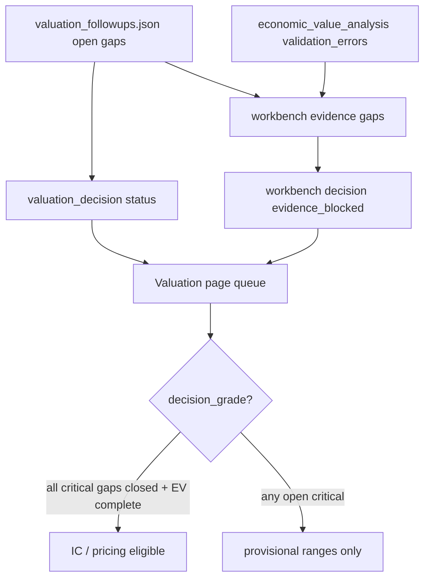

# Plan: Clear Valuation-page evidence blockers

**As of:** 2026-07-17  
**Page:** https://magis-capital-partners.github.io/single-stock-investments/#/valuation  
**Source of truth for queue badges:** `_system/reference/valuation_followups.json` + per-ticker `valuation_workbench.json` (via `build_dashboard_data.py`)

## Diagnosis (current dashboard)

| Metric | Value |
|--------|------:|
| Queue tickers | 30 |
| Evidence blocked | **30 / 30** |
| Decision-grade | 0 |
| Open gaps | 105 |
| Critical gaps | 85 |

**What “evidence blocked” means here:** any open gap in `valuation_followups.json` (status not in `resolved|accepted|not_applicable|met`) forces `decision_status=evidence_blocked` on the Valuation tab. Closing a gap is an acceptance-test pass with primary evidence, not a status flip.

There are **two blocker layers**:

1. **Followups gaps (dominant)** — curated questions with acceptance tests. 19 of 30 names still have only the universal critical trio and no `valuation.json`.
2. **Economic-value validator / workbench** — even when `economic_value_analysis.status=complete`, workbench stays `evidence_blocked` while followups gaps remain open. Two names also have hard validator errors (`HGBL`, `STHO`).



## Inventory by readiness

### Tier A — closest to decision-grade (complete EV; specific gaps)

| Ticker | Profile | Crit | Next gap | Progress |
|--------|---------|-----:|----------|----------|
| **TPL** | scarce_asset | 1 | `tract_level_royalty_inventory` | partially_met (~224k NRA; tract split open) |
| **LB** | scarce_asset | 1 | `alpha_digital_lease_economics` | lease economics |
| **AZLCZ** | scarce_asset | 1 | `contract_and_ownership_waterfalls` | ownership waterfall |
| **WBI** | infrastructure | 1 | `project_cohort_roic` | cohort ROIC |
| **MSB** | scarce_asset *(cohort)* | 2 | `royalty_reserve_reconciliation` | PV bridge / operator reserve |
| **MSB** | | | `legal_option_record` | Sept 2025 claim undisclosed |
| **C** | credit *(cohort)* | 3 | segment RoTCE / distributable capital / stress | partially_met |
| **NVR** | quality *(cohort)* | 3 | owner earnings / lots / surplus cash | partially_met |
| **NUE** | capital_cycle *(cohort)* | 3 | through-cycle / capacity / project ROIC | mixed |
| **BIIB** | binary *(cohort)* | 3 | product CF / pipeline trees / closing claims | partially_met |

### Tier B — mechanical EV contract broken (fix first)

| Ticker | Validator error theme |
|--------|------------------------|
| **HGBL** | option `debtx_commercial_loan_platform` missing probability / timing / remaining-capital |
| **STHO** | three option components missing same risk-and-timing fields |

### Tier C — first-pass inventory only (no `valuation.json`; universal trio)

19 names, each with critical: `component_ownership_map`, `primary_cash_or_nav_bridge`, `downside_and_capital_claims`.

**Core/hold wave:** CPRT, CSU, 8697.T, AMZN, BN, DHR, FRMO, GOOGL, ICE, QDEL, SPGI, TEQ.ST  

**Thematic sleeve:** APLD, DMLP, PSK.TO, FNV, RGLD, KEWL, BWEL  

These cannot become decision-grade until they have a complete `component_valuation` + `economic_value` schedule **and** the trio acceptance tests pass.

## Fix plan (phased)

### Phase 0 — Unblock the page mechanics (1 session)

1. **HGBL / STHO:** add `risk_and_timing` (or driver_model probability/timing/capital) on every `real_option` / option-method component; rerun `marvin_valuation.py --ticker {T} --write` until `economic_value_analysis.status=complete`.
2. Rebuild workbenches: `python _system/scripts/build_valuation_workbench.py {T}`.
3. Refresh dashboard rows / `build_dashboard_data.py` so validator-sourced gaps clear.
4. **Optional UX:** on Valuation queue, show `partially_met` vs `not_met` from `progress_note` (today everything looks equally red). Does not change decision-grade rules.

**Exit:** 0 validator `economic_validation_*` criticals on the queue cohort.

### Phase 1 — Validation cohort to first decision-grade (priority)

Work **one ticker + one acceptance test at a time** (UI copy already says this).

Order (easiest / most primary evidence first):

1. **MSB** — finish royalty PV bridge from Cliffs/Northshore primary; document Arb II as high-only or close `legal_option_record` with disclosure or `not_applicable` if unrecoverable.
2. **NVR** — owner-earnings cycle bridge + controlled-lot economics + minimum liquidity budget.
3. **C** — segment capital / RoTCE normalization + CET1 distributable bridge + severe stress common-scenario.
4. **NUE** — multi-cycle maintenance owner earnings + independent capacity/replacement map + WV mill ROIC.
5. **BIIB** — product-level margin/erosion + pipeline probability trees + post-close claims (debt/CVR) in downside.

**Per gap workflow (repeatable):**

```text
1. Pull primary evidence into {T}/research/evidence* or filings
2. Update component low/base/high + proof row in valuation.json
3. Write/update evidence_reconciliation_*.md (or JSON) showing acceptance_test met
4. Set followups gap status to met|resolved|accepted|not_applicable + progress_note
5. build_valuation_workbench.py {T}
6. refresh_valuation_dashboard_rows.py / build_dashboard_data.py
7. Confirm queue: critical_gap_count↓ ; decision_status flips only when open critical = 0
```

**Exit:** ≥1 cohort ticker `decision_grade` on the Valuation page (proves the pipe). Prefer MSB or NVR.

### Phase 2 — Finish Tier A singles (TPL, LB, AZLCZ, WBI)

Each has **one** critical gap. Same workflow as Phase 1. These are the fastest path to raising `decision_grade` count after the cohort pilot.

**Exit:** 4 additional decision-grade (or explicitly `not_applicable` with IC note).

### Phase 3 — Tier C universal-trio factory (batch, still evidence-gated)

For each of the 19 first-pass names:

1. **Scaffold** full `component_economic_value` schedule (templates in `_system/templates/component_valuation_templates.json`; gold ref `MSB/research/valuation.json`).
2. Close trio in order:
   - `component_ownership_map` — every material claim once, unique `overlap_key`
   - `primary_cash_or_nav_bridge` — owner cash or NAV from primary filings
   - `downside_and_capital_claims` — debt, reserves, capital calls, bear case
3. Only then open profile-specific gaps (do not invent 10 gaps before the schedule exists).

**Batching suggestion by profile:**

| Batch | Tickers | Shared method |
|-------|---------|---------------|
| 3a Land/royalty | TPL-adjacent already done; DMLP, PSK.TO, FNV, RGLD, KEWL, BWEL, FRMO, BN | scarce_asset schedule |
| 3b Infra | ICE, TEQ.ST, 8697.T, APLD | infrastructure / contracted growth |
| 3c Quality | AMZN, GOOGL, CPRT, CSU, DHR, SPGI | owner earnings + reinvestment |
| 3d Binary | QDEL | milestone tree (BIIB pattern) |

**Exit:** every Tier C name has `valuation.json` with `cv=complete` and `ev=complete`; trio gaps `met` or replaced by 1–3 *specific* open gaps.

### Phase 4 — Portfolio hygiene (ongoing)

1. Keep `expansion_waves.phase2_valuation_json_backfill` status honest (`queued` → `in_progress` → `done`).
2. Do **not** mark gaps `met` without an acceptance-test artifact (file path in `evidence_path` / `progress_note`).
3. Nightly / PR: `build_dashboard_data.py` so Pages shows the same counts as local.
4. IC gate remains: no committee freeze while `evidence_blocked` (already enforced in ls-algo / IC pipeline).

## What “fixed” looks like on the page

| Signal | Today | Target after Phase 1–2 |
|--------|-------|-------------------------|
| Evidence blocked | 30 | ≤20 |
| Decision-grade | 0 | ≥5 (cohort + Tier A) |
| Critical gaps | 85 | ≤60 |
| Validator errors | HGBL, STHO | 0 |

Ranges may still show “provisional” until decision-grade; that is correct behavior.

## Explicit non-goals

- Do not force-flip followups statuses to green the UI.
- Do not treat Lawrence IRR alone as contract-compliant decision-grade.
- Do not expand the queue to all 643 holdings until the cohort path produces ≥1 real decision-grade name.

## Suggested next action (immediate)

Start **Phase 0 (HGBL + STHO)** then **Phase 1 gap #1 on MSB** (`royalty_reserve_reconciliation`), because MSB already has the richest primary packet and is the scarce-asset gold standard for the methodology.
